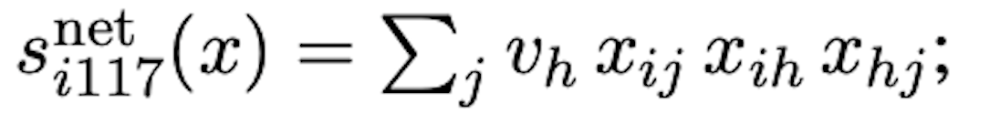
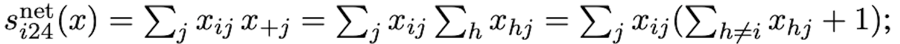

```{r}
rm(list= ls())
```

```{r, echo=TRUE, results='hide', message=FALSE, warning=FALSE}
library(knitr)
library(tidyverse)
library(scholar)
library(openalexR)
library(rvest)
library(jsonlite)
library(httr)
library(rvest)
library(reshape2)
library(xml2)
library(openxlsx)
library(polite)
library(igraph)
library(sna)
library(genderizeR)
library(RSelenium)
library(netstat)
library(pingr)
library(RSiena)
library(devtools)
library(RsienaTwoStep)


# load the functions you need from the packages
fpackage.check <- function(packages) {
  lapply(packages, FUN = function(x) {
    if (!require(x, character.only = TRUE)) {
      install.packages(x, dependencies = TRUE)
      library(x, character.only = TRUE)
    }
  })
}

fsave <- function(x, file = NULL, location = "./data/processed/") {
  ifelse(!dir.exists("data"), dir.create("data"), FALSE)
  ifelse(!dir.exists("data/processed"), dir.create("data/processed"), FALSE)
  
  if (is.null(file)) {
    file <- deparse(substitute(x))
  }
  
  datename <- substr(gsub("[:-]", "", Sys.time()), 1, 8)
  totalname <- paste(location, datename, file, ".rda", sep = "")
  save(x, file = totalname)  # need to fix if file is reloaded as input name, not as x.
}

fload <- function(filename) {
  load(filename)
  get(ls()[ls() != "filename"])
}

fshowdf <- function(x, ...) {
  knitr::kable(x, digits = 2, "html", ...) %>%
    kableExtra::kable_styling(bootstrap_options = c("striped", "hover")) %>%
    kableExtra::scroll_box(width = "100%", height = "300px")
}
```

```{r klippy, echo=FALSE, include=TRUE}
klippy::klippy(position = c('top', 'right'))
#klippy::klippy(color = 'darkred')
#klippy::klippy(tooltip_message = 'Click to copy', tooltip_success = 'Done')
```

Last compiled on `r format(Sys.time(), '%B, %Y')`
<br>
------------------------------------------------------------------------

# Week 5
<br>
------------------------------------------------------------------------

## Create Dataset
<br>

------------------------------------------------------------------------
### Genderize function
```{r, eval = F}

my_genderizer <- function(name) {
  name <- gsub("^/+|/+$", "", name)
  
  # Build URL
  base_url <- "https://nvb.meertens.knaw.nl/naam/is"
  name_url <- paste0(base_url, "/", name)
  
  # Try reading table
  table <- tryCatch(
    read_html(name_url) |>
      html_element("table") |>
      html_table(),
    error = function(e) NULL
  )
  
  if (is.null(table)) return(NA)  # return NA if no table found
  
  # Replace "--" with "0"
  table[table == "--"] <- "0"
  
  # Convert to numeric
  val_male   <- suppressWarnings(as.numeric(table[2, 3]))
  val_female <- suppressWarnings(as.numeric(table[6, 3]))
  
  # Decide gender
  if (is.na(val_male) & is.na(val_female)) {
    gender <- NA
  } else if (val_male > val_female) {
    gender <- "male"
  } else if (val_female > val_male) {
    gender <- "female"
  } else {
    gender <- NA
  }
  
  return(gender)
}
```

<br>
### Load the data

```{r, eval = F}
# load in the data
scholars <- fload("./data/processed/scholars_20240924.rda")

# select scholars
# (sociology, RU)
demographics <- do.call(rbind.data.frame, scholars$demographics)
demographics <- demographics %>%
    mutate(Universiteit1.22 = replace(Universiteit1.22, is.na(Universiteit1.22), ""), Universiteit2.22 = replace(Universiteit2.22,
        is.na(Universiteit2.22), ""), Universiteit1.24 = replace(Universiteit1.24, is.na(Universiteit1.24),
        ""), Universiteit2.24 = replace(Universiteit2.24, is.na(Universiteit2.24), ""), discipline.22 = replace(discipline.22,
        is.na(discipline.22), ""), discipline.24 = replace(discipline.24, is.na(discipline.24), ""))

sample <- which((demographics$Universiteit1.22 == "RU" | demographics$Universiteit2.22 == "RU" | demographics$Universiteit1.24 ==
    "RU" | demographics$Universiteit2.24 == "RU") & (demographics$discipline.22 == "sociology" | demographics$discipline.24 ==
    "sociology"))

demographics_soc <- demographics[sample, ]
scholars_sel <- lapply(scholars, "[", sample)

# construct the empty adjacency matrix
ids <- demographics_soc$au_id
wave2 <- wave1 <- matrix(0, nrow = length(ids), ncol = length(ids), dimnames = list(ids, ids))

# filter works
works <- scholars_sel$work

works_id <- unlist(lapply(works, function(l) l$id))
works_author <- unlist(lapply(works, function(l) l$author), recursive = FALSE)
works_year <- unlist(lapply(works, function(l) l$publication_year), recursive = FALSE)

df_works <- tibble(works_id, works_author, works_year)

dups <- which(duplicated(works_id))

df_works <- df_works[-dups, ]
df_works_w2 <- df_works[df_works$works_year > 2019, ]

# undirected
# undirected
for (i in 1:nrow(df_works_w2)) {
    egos <- df_works_w2$works_author[i][[1]]$au_id

    if (sum(ids %in% egos) > 0) {
        wave2[which(ids %in% egos), which(ids %in% egos)] <- 1
    }
}

fcolnet <- function(data = scholars, university = "RU", discipline = "sociology", waves = list(c(2015,
    2018), c(2019, 2023)), type = c("first")) {

    # step 1
    demographics <- do.call(rbind.data.frame, data$demographics)
    demographics <- demographics %>%
        mutate(Universiteit1.22 = replace(Universiteit1.22, is.na(Universiteit1.22), ""), Universiteit2.22 = replace(Universiteit2.22,
            is.na(Universiteit2.22), ""), Universiteit1.24 = replace(Universiteit1.24, is.na(Universiteit1.24),
            ""), Universiteit2.24 = replace(Universiteit2.24, is.na(Universiteit2.24), ""), discipline.22 = replace(discipline.22,
            is.na(discipline.22), ""), discipline.24 = replace(discipline.24, is.na(discipline.24), ""))

    sample <- which((demographics$Universiteit1.22 %in% university | demographics$Universiteit2.22 %in%
        university | demographics$Universiteit1.24 %in% university | demographics$Universiteit2.24 %in%
        university) & (demographics$discipline.22 %in% discipline | demographics$discipline.24 %in% discipline))

    demographics_soc <- demographics[sample, ]
    scholars_sel <- lapply(scholars, "[", sample)

    # step 2
    ids <- demographics_soc$au_id
    nwaves <- length(waves)
    nets <- array(0, dim = c(nwaves, length(ids), length(ids)), dimnames = list(wave = 1:nwaves, ids,
        ids))
    dimnames(nets)

    # step 3
    df_works <- tibble(works_id = unlist(lapply(scholars_sel$work, function(l) l$id)), works_author = unlist(lapply(scholars_sel$work,
        function(l) l$author), recursive = FALSE), works_year = unlist(lapply(scholars_sel$work, function(l) l$publication_year),
        recursive = FALSE))

    df_works <- df_works[!duplicated(df_works), ]

    # step 4
    if (type == "first") {
        for (j in 1:nwaves) {
            df_works_w <- df_works[df_works$works_year >= waves[[j]][1] & df_works$works_year <= waves[[j]][2],
                ]
            for (i in 1:nrow(df_works_w)) {
                ego <- df_works_w$works_author[i][[1]]$au_id[1]
                alters <- df_works_w$works_author[i][[1]]$au_id[-1]
                if (sum(ids %in% ego) > 0 & sum(ids %in% alters) > 0) {
                  nets[j, which(ids %in% ego), which(ids %in% alters)] <- 1
                }
            }
        }
    }

    if (type == "last") {
        for (j in 1:nwaves) {
            df_works_w <- df_works[df_works$works_year >= waves[[j]][1] & df_works$works_year <= waves[[j]][2],
                ]
            for (i in 1:nrow(df_works_w)) {
                ego <- rev(df_works_w$works_author[i][[1]]$au_id)[1]
                alters <- rev(df_works_w$works_author[i][[1]]$au_id)[-1]
                if (sum(ids %in% ego) > 0 & sum(ids %in% alters) > 0) {
                  nets[j, which(ids %in% ego), which(ids %in% alters)] <- 1
                }
            }
        }
    }

    if (type == "all") {
        for (j in 1:nwaves) {
            df_works_w <- df_works[df_works$works_year >= waves[[j]][1] & df_works$works_year <= waves[[j]][2],
                ]
            for (i in 1:nrow(df_works_w)) {
                egos <- df_works_w$works_author[i][[1]]$au_id
                if (sum(ids %in% egos) > 0) {
                  nets[j, which(ids %in% egos), which(ids %in% egos)] <- 1
                }
            }
        }
    }
    output <- list()
    output$data <- scholars_sel
    output$nets <- nets
    return(output)
}

df_scholars <- do.call(rbind, scholars$demographics)
```
<br>
### Attach gender
```{r, eval = F}
df_scholars_gender <- df_scholars |>
  mutate(firstname = word(Naam, 1))  # extract first names

df_scholars_gender$gender <- NA_character_  # initialize gender column

for (i in seq_len(nrow(df_scholars_gender))) {
  name <- df_scholars_gender$firstname[i]
  gender <- my_genderizer(name)
  
  df_scholars_gender$gender[i] <- gender
  Sys.sleep(0.06)  # pause between requests
}
```
<br>
### Big data
```{r}
fcolnet_gender <- function(data = scholars,
                           waves = list(c(2015, 2018), c(2019, 2023)),
                           type = "first",
                           demographics = NULL) {
  
  # -------------------------
  # Step 1: demographics
  # -------------------------
  if (is.null(demographics)) {
    demographics <- do.call(rbind.data.frame, data$demographics)
  }
  
  demographics <- demographics %>%
    mutate(
      Universiteit1.22 = replace(Universiteit1.22, is.na(Universiteit1.22), ""),
      Universiteit2.22 = replace(Universiteit2.22, is.na(Universiteit2.22), ""),
      Universiteit1.24 = replace(Universiteit1.24, is.na(Universiteit1.24), ""),
      Universiteit2.24 = replace(Universiteit2.24, is.na(Universiteit2.24), ""),
      discipline.22    = replace(discipline.22,    is.na(discipline.22),    ""),
      discipline.24    = replace(discipline.24,    is.na(discipline.24),    "")
    )
  
  # -------------------------
  # select all scholars
  # -------------------------
  sample <- seq_len(nrow(demographics))
  
  demographics_all <- demographics[sample, ]
  scholars_sel <- lapply(data, "[", sample)
  
  # -------------------------
  # Step 2: initialize network array
  # -------------------------
  ids <- demographics_all$au_id
  nwaves <- length(waves)
  nets <- array(
    0,
    dim = c(nwaves, length(ids), length(ids)),
    dimnames = list(wave = 1:nwaves, ids, ids)
  )
  
  # -------------------------
  # Step 3: works dataframe
  # -------------------------
  df_works <- tibble(
    works_id     = unlist(lapply(scholars_sel$work, function(l) if(!is.null(l)) l$id else NA)),
    works_author = unlist(lapply(scholars_sel$work, function(l) if(!is.null(l)) l$author else NA), recursive = FALSE),
    works_year   = unlist(lapply(scholars_sel$work, function(l) if(!is.null(l)) l$publication_year else NA), recursive = FALSE)
  ) %>% filter(!is.na(works_id))
  
  df_works <- df_works[!duplicated(df_works), ]
  
  # -------------------------
  # Step 4: build networks
  # -------------------------
  if (type == "first") {
    for (j in 1:nwaves) {
      df_works_w <- df_works[df_works$works_year >= waves[[j]][1] &
                               df_works$works_year <= waves[[j]][2], ]
      for (i in 1:nrow(df_works_w)) {
        ego <- df_works_w$works_author[i][[1]]$au_id[1]
        alters <- df_works_w$works_author[i][[1]]$au_id[-1]
        if (sum(ids %in% ego) > 0 & sum(ids %in% alters) > 0) {
          nets[j, which(ids %in% ego), which(ids %in% alters)] <- 1
        }
      }
    }
  }
  
  if (type == "last") {
    for (j in 1:nwaves) {
      df_works_w <- df_works[df_works$works_year >= waves[[j]][1] &
                               df_works$works_year <= waves[[j]][2], ]
      for (i in 1:nrow(df_works_w)) {
        ego <- rev(df_works_w$works_author[i][[1]]$au_id)[1]
        alters <- rev(df_works_w$works_author[i][[1]]$au_id)[-1]
        if (sum(ids %in% ego) > 0 & sum(ids %in% alters) > 0) {
          nets[j, which(ids %in% ego), which(ids %in% alters)] <- 1
        }
      }
    }
  }
  
  if (type == "all") {
    for (j in 1:nwaves) {
      df_works_w <- df_works[df_works$works_year >= waves[[j]][1] &
                               df_works$works_year <= waves[[j]][2], ]
      for (i in 1:nrow(df_works_w)) {
        egos <- df_works_w$works_author[i][[1]]$au_id
        if (sum(ids %in% egos) > 0) {
          nets[j, which(ids %in% egos), which(ids %in% egos)] <- 1
        }
      }
    }
  }
  
  # -------------------------
  # Step 5: output
  # -------------------------
  output <- list()
  output$data <- scholars_sel
  output$nets <- nets
  output$demographics <- demographics_all  # includes gender if passed in
  
  return(output)
}

```
### output
```{r, eval = F}
result_gender2 <- fcolnet_gender(
  data = scholars,
  demographics = df_scholars_gender,
  waves = list(c(2015, 2018), c(2019,2023)),
  type= "first"
)

# View gender info
head(result_gender2$demographics[, c("au_id", "firstname", "gender")])

# Save entire result (list containing networks, data, demographics, etc.)
save(result_gender2, file = "./data/processed/result_gender2.rda")

```
------------------------------------------------------------------------

## First analyses
<br>

### Check waves
```{r}

load("./data/processed/result_gender2.rda")

wave1 <- result_gender2$nets[1,,]
wave2 <- result_gender2$nets[2,,]

# filter out the waves of the object: we need to check our input
#dim(wave1)
#dim(wave2)

# you need to have 0 missing values:
#sum(is.na(wave1))
#sum(is.na(wave2))

#check the diagonal: all places should be 0
#sum(diag(wave1)==0)
#sum(diag(wave2)==0)

# a few people did work with themselves:
#diag(wave1) <- 0
#diag(wave2) <- 0

# everything should be 1 or 0:
#sum(wave1>1)
#sum(wave2>1)

# check if it's not empty: there are people with 1's
#sum(wave1>0)
#sum(wave2>0)

net_gender <- array(data = c(wave1, wave2), dim = c(dim(wave1), 2))
# net_gender

# dependent
net2 <- sienaDependent(net_gender)

# independent variables
gender <- result_gender2$demographics$gender

gender <- ifelse(gender=="female",1,0)
gender <- coCovar(gender)

#gender

# Create siena data object
mydata3 <- sienaDataCreate(net2, gender)
mydata3
```

```{r}
myeff <-getEffects(mydata3)

ifelse(!dir.exists("results"), dir.create("results"), FALSE)
print01Report(mydata3, modelname = "./results/soc_init2")
```

### Include effects
```{r, eval = F}
myeff <- includeEffects(myeff, egoX, interaction1 = "gender", type = "eval", include = T)   

# can allso add the altX to the equation
myeff <- setEffect(myeff, altX, interaction1 = "gender", include = T)  

# can also add egoXaltX
myeff <- setEffect(myeff, egoXaltX, interaction1 = "gender", include = T)

myAlgorithm <- sienaAlgorithmCreate(projname = "soc_init")
ansM1 <- siena07(myAlgorithm, data = mydata3, effects = myeff, returnDeps = TRUE)
# if necessary estimate again!  ansM1 <- siena07(myAlgorithm, data = mydata, effects = myeff,
# prevAns = ansM1, returnDeps=TRUE)
ansM1
```
<br>
This means that:

Outdegree:	Significant and negative (b = -4.1697, SE = 0.0827): there is an overall tendency not to form ties (most people collaborate with few others)

Reciprocity: Significant and positive (b = 3.7150, SE = 0.1708): mutual collaborations are more likely: if A co-authors with B, B is more likely to co-author with A.

Gender ego:	Significant and positive (b = 0.4094, SE = 0.1549): Being a woman increases the likelihood of initiating co-authorships.	

Gender alter: Significant and negative (b = -0.2908, SE = 0.0826):	Being a woman decreases the likelihood of being chosen as a co-author.

Gender ego × gender alter: Significant and positive (b = 0.5069, SE = 0.1626) : Suggests same-gender collaborations are more likely than cross-gender ones.

------------------------------------------------------------------------

## RSienna chapters
<br>

### Chapter 2
The defining characteristic of Stochastic Actor-Oriented Models is their ‘actor-oriented’ nature
which means that they model change from the perspective of the actors (nodes).

For network evolution, three conceptual functions may be used: evaluation, creation, and endowment. These differ in whether one models all tie presence (evaluation), just tie formation (creation), or tie maintenance (endowment). 

Effects: These are the modeled influences (explanatory factors) on change.

  - Structural effects (endogenous) e.g. reciprocity, transitivity
  
  - Covariate effects (exogenous) e.g. similarity, attribute of sender/receiver
  
  - Interaction effects (combinations) e.g. interaction of structure and covariate 
  
Estimation procedure:

RSiena uses the function siena07 to estimate parameters.The goal is that the model-implied (expected) network/behavioral statistics match observed statistics. 

The estimation proceeds in phases:

  - Estimate sensitivity of statistics to parameters
  
  - Iterative updates: simulate networks, compute deviations, adjust parameters
  
  - Check convergence: whether simulated statistics are close enough to observed targets

If convergence criteria are not met, estimation may be repeated or refined. 

<br>
### Chapter 5

In many applications, it’s best to start with a simple baseline model (e.g. including only core structural effects like out-degree and reciprocity).

From there, add or remove effects (in small sets, e.g. 1–3 at a time), assessing convergence, interpretability, and fit at each stage.

It is wise to always retain certain “anchor” effects (e.g. out-degree or rate parameters) even if they are not statistically significant, because they stabilize the model structure.

------------------------------------------------------------------------

## Second analyses

### transTrip
There are many Structural effects you can include. I tried around with triangulation, but I did not think it really fit my gender research. It could be interesting: if you have A -> B -> C, would the gender of B impact whether A -> C would collaborate. 

```{r, eval = F}
myeff <- includeEffects(myeff, egoX, interaction1 = "gender", type = "eval", include = T) 
myeff <- setEffect(myeff, altX, interaction1 = "gender", include = T) 
myeff <- setEffect(myeff, egoXaltX, interaction1 = "gender", include = T)

myeff <- includeEffects(myeff, transTrip, include = T)
myeff <- includeEffects(myeff, transTripX, interaction1 = "gender", type = "eval", include = T)

myAlgorithm <- sienaAlgorithmCreate(projname = "soc_init")
ansM2 <- siena07(myAlgorithm, data = mydata3, effects = myeff, returnDeps = TRUE)
# if necessary estimate again!  ansM1 <- siena07(myAlgorithm, data = mydata, effects = myeff,
# prevAns = ansM1, returnDeps=TRUE)
ansM2

```
The network shows a significant tendency toward transitive closure (b = 1.9166, SE = 0.1786), meaning that “friends of friends” are more likely to become connected. The effect of transitive triplets moderated by the intermediate person’s gender is not significant (b = 0.1580, SE = 0.5294), suggesting that the gender of the intermediate has no influence on whether triads close. If you have A -> B -> C, the gender of B does not impact whether A -> C would collaborate. 

<br>

Formula:

<br>
For all alters j, if ego i is tied to an intermediary h who is a woman (male = 0, female = 1) and intermediary h has a connection to alter j, and alter j has a connection to ego i, then that configuration adds 1 to i's transTripX statistic.

<br>

### inPop
```{r, eval = F}
# first put the triadic effects on: do not include
myeff <- includeEffects(myeff, transTrip, include = F)
myeff <- includeEffects(myeff, transTripX, interaction1 = "gender", type = "eval", include = F)

# Get ego, alt and egoalt effects
myeff <- includeEffects(myeff, egoX, interaction1 = "gender", type = "eval", include = T) 
myeff <- setEffect(myeff, altX, interaction1 = "gender", include = T) 
myeff <- setEffect(myeff, egoXaltX, interaction1 = "gender", include = T)

myeff <- includeEffects(myeff, inPop, include = T)

myeff <- includeInteraction(myeff, egoX, inPop, interaction1 = c("gender", ""), type = "eval", include = T)

myAlgorithm <- sienaAlgorithmCreate(projname = "soc_init")
ansM3 <- siena07(myAlgorithm, data = mydata3, effects = myeff, returnDeps = TRUE)
# if necessary estimate again!  ansM1 <- siena07(myAlgorithm, data = mydata, effects = myeff,
# prevAns = ansM1, returnDeps=TRUE)
ansM3
```
<br>

I am not sure whether I am interpreting this correctly but: 

The indegree-popularity effect was significant and positive (b = 0.19, SE = 0.03) uggesting that actors who received more nominations were more likely to attract additional ones.

Women in the network initially received fewer ties than men, but after including the indegree–popularity effect, the main gender effects were no longer significant (gender ego: b = 0.33, SE = 0.22; gender alter: b = –0.14, SE = 0.13). This suggests that the observed gender differences were largely explained by popularity rather than gender itself. The interaction between gender ego and indegree–popularity (b = 0.03, SE = 0.06) was also non-significant, indicating that popularity influences tie formation similarly for men and women. Overall, gender differences in tie initiation appear to stem from structural network dynamics—such as a preference for connecting to already popular alters, among whom men are likely overrepresented—rather than from direct gender-based effects.

<br>
The formula:

For all alter's (j): if an ego (i) has a tie to an alter (j) sum for the alter (j) the number of its alters (h) which are not ego (i), and then you do plus one because you also want to count the one connection to ego (i). 
