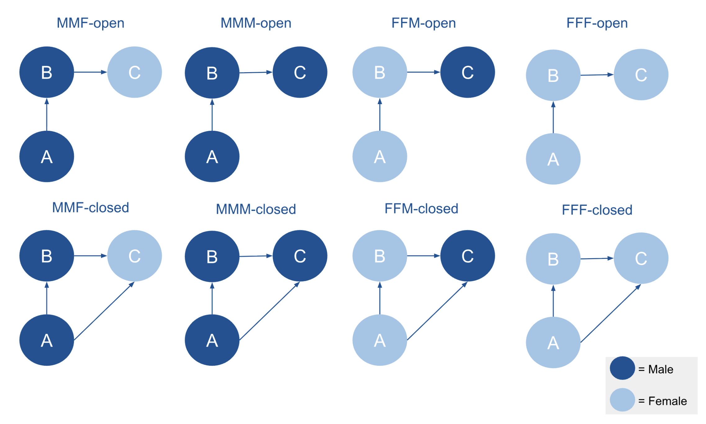

```{r, echo=FALSE, include=TRUE, results='hide', message=FALSE, warning=FALSE}
library(knitr)
library(tidyverse)
library(scholar)
library(openalexR)
library(rvest)
library(jsonlite)
library(httr)
library(rvest)
library(reshape2)
library(xml2)
library(openxlsx)
library(polite)
library(igraph)
library(sna)
library(genderizeR)
library(RSelenium)
library(netstat)
library(pingr)
library(RSiena)
library(devtools)
library(RsienaTwoStep)


# load the functions you need from the packages
fpackage.check <- function(packages) {
  lapply(packages, FUN = function(x) {
    if (!require(x, character.only = TRUE)) {
      install.packages(x, dependencies = TRUE)
      library(x, character.only = TRUE)
    }
  })
}

fsave <- function(x, file = NULL, location = "./data/processed/") {
  ifelse(!dir.exists("data"), dir.create("data"), FALSE)
  ifelse(!dir.exists("data/processed"), dir.create("data/processed"), FALSE)
  
  if (is.null(file)) {
    file <- deparse(substitute(x))
  }
  
  datename <- substr(gsub("[:-]", "", Sys.time()), 1, 8)
  totalname <- paste(location, datename, file, ".rda", sep = "")
  save(x, file = totalname)  # need to fix if file is reloaded as input name, not as x.
}

fload <- function(filename) {
  load(filename)
  get(ls()[ls() != "filename"])
}

fshowdf <- function(x, ...) {
  knitr::kable(x, digits = 2, "html", ...) %>%
    kableExtra::kable_styling(bootstrap_options = c("striped", "hover")) %>%
    kableExtra::scroll_box(width = "100%", height = "300px")
}
```

```{r klippy, echo=FALSE, include=TRUE}
klippy::klippy(position = c('top', 'right'))
#klippy::klippy(color = 'darkred')
#klippy::klippy(tooltip_message = 'Click to copy', tooltip_success = 'Done')
```

Last compiled on `r format(Sys.time(), '%B, %Y')`
<br>
------------------------------------------------------------------------

# Data and Methods
<br>

## Data
To test the hypotheses, I use social network data on 674 researchers from the Sociology and Political Science departments across Dutch universities. These data were collected in 2022 and 2024 as part of a project mapping collaborations among Dutch university scholars in these disciplines.

The data was collected as follows. First, all staff members of Sociology and Political Science departments at Dutch universities were identified, and their names, affiliations, academic positions, and Google Scholar IDs were recorded. Second, publication data were retrieved from OpenAlex, a nonprofit open-science database [@openalex].

It is important to note that the collection years (2022 and 2024) do not define the analytical waves. In this study, I focus on two periods: 2015–2018 (Wave 1) and 2019–2023 (Wave 2).

Collaboration networks were constructed by identifying co-authorships within each wave. These co-authorships can be represented as either undirected or directed networks. In the case of a directed network, directionality can be defined from the first-named author to others or from the last-named author to others. I adopt the latter approach, as it reflects academic hierarchies in which senior scholars, who are typically listed last, are more likely to initiate collaborations.

After constructing the co-authorship networks, the overall structure of the data can be described as a complete, or “socionet,” network [@SNASS]. Such networks are defined by clearly specified boundaries and complete information on all actors and their relationships within those boundaries. In this research project, the network boundary is defined by all researchers affiliated with Sociology and Politicology departments at Dutch universities between 2015 and 2023. The dataset includes all individuals within this defined academic context and all known collaborations among them. Because both the population of actors and their intra-boundary ties are fully captured, the data constitute a complete, or socionet.

Besides collaboration ties, the data also includes node-level attributes. These encompass time-varying characteristics, such as each researcher’s position and university affiliation, and time-constant characteristics, such as their name and discipline.

### Covariate Gender

In this study, I manually included gender as a (usually) time-constant characteristic. Each researcher’s gender was inferred from their first name using the Nederlandse Voornamenbank (NVB) of the Meertens Institute. First, I extracted the first name from each researcher’s full name and applied a custom R function I developed. This function automatically queried the NVB database, retrieved the corresponding gender frequency table, and assigned the researcher as male or female based on the most common association. If a name was not found in the NVB database or if the name field was incomplete or incorrectly formatted, the function returned NA. As a result, 22 researchers (3.26 %) have missing gender values in the final demographic dataset.

### Control covariates

To account for other factors that may influence the formation or closure of triads, I include controls for university affiliation and discipline. These variables are already available in the dataset. Although university affiliation can change over time, I have data from only two waves; therefore, it will be included as a time-constant covariate.

<br>

## Methods

<br>

### Descriptive 

For the descriptive research questions I will first perform a triad census to see which triad configurations appear in this network, with a focus to the triad configurations I am most interested in namely A -> B -> C (021C) and the closed one in which A sends a tie to C namely A -> B - > C <- A (030T). Second, I will analyze how frequently these specific triads occur in the configurations shown below (note that in this figure, gender is specified, whereas in the other figures, only the distinction between same-gender and different-gender configurations is shown).



Based on these configurations, I can calculate the frequency of different gender compositions within the triads. By comparing these observed frequencies to the expected frequencies given the overall proportion of men and women in the network, I can assess whether certain gendered open or closed triads occur more or less often than expected by chance.

### Explanatory

The explanatory hypotheses will be addressed using Stochastic Actor-Oriented Models (SAOMs) with RSiena [@Rsiena]. SAOMs model network evolution over time by simulating probabilistic changes in ties based on specified network statistics, which function as independent variables. RSiena distinguishes between structural effects (network-level tendencies, e.g., reciprocity, popularity, or triadic closure) and covariate effects (node characteristics, e.g., gender, prestige). 

To test the hypotheses, I will focus on two RSiena statistics: “jumpXTransTrip” and “homXTransTrip”, both interacting with gender. 

“jumpXTransTrip” captures the tendency of actors to close a triad by forming a tie to a node of a different attribute, reflecting cross-gender closure or bridging tendencies. In other words, if a focal actor i is connected to h, and h is connected to j, then jumpXTransTrip increases the probability that i will form or maintain a tie to j when i and h share the same gender and j has a different gender.

The corresponding statistic captures the tendency for an actor i to form or maintain a tie to another actor j when a third actor h serves as a connecting intermediary. Specifically, for all potential alters j (who are not h), the statistic examines whether there is an existing tie from i to j, a tie from i to h, and a tie from h to j (if the triad is already closed). It then restricts attention to cases where actor i and intermediary h share the same gender, while j differs in gender.

In the actor-oriented framework, this statistic contributes to the model’s evaluation function by increasing (or decreasing) the probability that actor i will make a micro-step to create or maintain a tie to j, depending on the estimated parameter. A positive coefficient for this effect means that, holding other effects constant, actor i is more likely to form or keep a tie to an out-group member j (of a different gender) when j is connected through an intermediary h who shares i’s gender. In other words, the statistic operationalizes a mechanism of indirect or mediated cross-gender closure: it measures how exposure to an out-group member through a same-gender collaborator affects tie formation dynamics.


In contrast, the “homXTransTrip” statistic measures the tendency of actors to form closed triads with others who share the same attribute, in this case, gender, capturing homophilic closure.

The corresponding formula examines, for all alter j’s, whether there is a tie from i to j, a tie from i to h and a tie from h to j, and then restricts attention to cases where node i, j and node h are of the same gender. Again, this statistic contributes to the model’s evaluation function by increasing (or decreasing) the probability that actor i will make a micro-step to create or maintain a tie to j, depending on the estimated parameter.


By interacting these statistics with gender, I can test whether A -> B -> C triads are more likely to close or be maintained (rather than broken or avoided) based on the gender of C relative to A and B. This allows me to assess whether triadic closure processes in the collaboration network tend to reinforce gender similarity or facilitate cross-gender connections.

It is worth noting that the concept of significance in RSiena differs from its use in conventional statistical analyses. In traditional methods like OLS regression, significance indicates that an estimate is statistically different from zero. In RSiena, by contrast, significance reflects how precisely an estimate has been determined [@Rsiena]. In the remainder of this chapter, the term “significance” will be used according to this RSiena-specific definition.

<br>

## Model construction:

The Model construction was a process of trial and error. I ultimately settled on the following sequence.


First, I constructed a null model, including only the standard RSiena effects for network density and reciprocity. For this baseline model, I conducted goodness-of-fit (GOF) tests for both the indegree and outdegree distributions.

Next, in Model 1, I introduced the main effects of theoretical interest (jumpXTransTrip and homXTransTrip) to test the three hypotheses. The same GOF tests were applied as for the null model to assess improvement in fit, and an additional GOF test was performed for the triad census to evaluate how well the model captured the triadic configurations in the observed network, which are central to the main effects. These three GOF tests were repeated for all subsequent models.

In Model 2, I added individual-level structural effects: outdegree activity (outAct), indegree popularity (inPop), and isolateNet. These parameters were included to improve the model’s fit to the observed indegree and outdegree distributions.

In Model 3, I incorporated dyadic-level effects. Specifically, I incorporated homophily effects using sameX for gender, university, and discipline. Gender homophily was included to control for the general tendency to collaborate with others of the same gender, which might otherwise confound the triadic gender effects. University and discipline homophily were added because researchers I expected collaborations within the same institutional or disciplinary contexts were more likely.

Finally, in Model 4, I included the TransTrip effect to better capture transitive closure in the network and to check whether the gender-related jumpXTransTrip and homXTransTrip effects reflected genuine gender dynamics or simply the general structural principle that “a friend of my friend is my friend.”

<br>

# References
