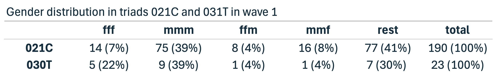

```{r, echo=FALSE, include=TRUE, results='hide', message=FALSE, warning=FALSE}
library(knitr)
library(tidyverse)
library(scholar)
library(openalexR)
library(rvest)
library(jsonlite)
library(httr)
library(rvest)
library(reshape2)
library(xml2)
library(openxlsx)
library(polite)
library(igraph)
library(sna)
library(genderizeR)
library(RSelenium)
library(netstat)
library(pingr)
library(RSiena)
library(devtools)
library(RsienaTwoStep)


# load the functions you need from the packages
fpackage.check <- function(packages) {
  lapply(packages, FUN = function(x) {
    if (!require(x, character.only = TRUE)) {
      install.packages(x, dependencies = TRUE)
      library(x, character.only = TRUE)
    }
  })
}

fsave <- function(x, file = NULL, location = "./data/processed/") {
  ifelse(!dir.exists("data"), dir.create("data"), FALSE)
  ifelse(!dir.exists("data/processed"), dir.create("data/processed"), FALSE)
  
  if (is.null(file)) {
    file <- deparse(substitute(x))
  }
  
  datename <- substr(gsub("[:-]", "", Sys.time()), 1, 8)
  totalname <- paste(location, datename, file, ".rda", sep = "")
  save(x, file = totalname)  # need to fix if file is reloaded as input name, not as x.
}

fload <- function(filename) {
  load(filename)
  get(ls()[ls() != "filename"])
}

fshowdf <- function(x, ...) {
  knitr::kable(x, digits = 2, "html", ...) %>%
    kableExtra::kable_styling(bootstrap_options = c("striped", "hover")) %>%
    kableExtra::scroll_box(width = "100%", height = "300px")
}
```

```{r klippy, echo=FALSE, include=TRUE}
klippy::klippy(position = c('top', 'right'))
#klippy::klippy(color = 'darkred')
#klippy::klippy(tooltip_message = 'Click to copy', tooltip_success = 'Done')
```

Last compiled on `r format(Sys.time(), '%B, %Y')`
<br>
------------------------------------------------------------------------

# Descriptive Analyses
<br>

For the descriptive analyses, my primary focus is on identifying which triads occur in the network data, with particular attention to 021C and 030T triads (RQ1), as well as examining the gender distribution within these specific triads (RQ2). To support the latter, I will also visualize the relevant parts of the network. However, before exploring these patterns in detail, I will first assess the overall gender distribution in the network to gain a clearer understanding of the dataset as a whole.

<br>

Load in the data
```{r}
load("./data/processed/result_gender2.rda")
```

<br>

## Independent Variable Gender

In the study population, gender was nearly evenly distributed, with 49.7% men (n = 335) and 47.0% women (n = 317). A small proportion of participants (3.3%, n = 22) had missing gender information.
```{r}
result_gender2$demographics |>
  mutate(gender = ifelse(is.na(gender), "missing", gender)) |>
  count(gender) |>
  mutate(percent = round(n / sum(n) * 100, 2))
```

## Control variables 

### First university
```{r}
result_gender2$demographics$Universiteit1.22[result_gender2$demographics$Universiteit1.22 == ""] <- NA

result_gender2$demographics |>
  mutate(Universiteit1.22 = ifelse(is.na(Universiteit1.22), "missing", Universiteit1.22)) |>
  count(Universiteit1.22) |>
  mutate(percent = round(n / sum(n) * 100, 2))

result_gender2$demographics$Universiteit1.24[result_gender2$demographics$Universiteit1.24 == ""] <- NA
result_gender2$demographics |>
  mutate(Universiteit1.24 = ifelse(is.na(Universiteit1.24), "missing", Universiteit1.24)) |>
  count(Universiteit1.24) |>
  mutate(percent = round(n / sum(n) * 100, 2))

# did people change university? Yes, 14 people
univ_wave22 <- result_gender2$demographics$Universiteit1.22
univ_wave24 <- result_gender2$demographics$Universiteit1.24

# Combine into a data frame
df_univ <- data.frame(
  actor = 1:length(univ_wave22),
  wave22 = univ_wave22,
  wave24 = univ_wave24
)

# Check which actors changed university
df_univ$changed <- df_univ$wave22 != df_univ$wave24

# Summary
table(df_univ$changed)
```

### department
In wave 1 there were 65 missing values for discipline, but in wave 2 there were none. Over time 65 people appear to have changed discipline. This however does not reflect a change of discipline, but the disciplines of the 65 people were likely filled in in wave 2 as they were not present in wave 1. Therefore, discipline is a constant variable, but for the analysis we need to take the disciplines from wave 2 as those are complete. 
```{r}

# Replace empty strings with NA
result_gender2$demographics$discipline.22[result_gender2$demographics$discipline.22 == ""] <- NA
result_gender2$demographics$discipline.24[result_gender2$demographics$discipline.24 == ""] <- NA

# Replace NA with "missing" and overwrite the variables
result_gender2$demographics <- result_gender2$demographics |>
  mutate(
    discipline.22 = ifelse(is.na(discipline.22), "missing", discipline.22),
    discipline.24 = ifelse(is.na(discipline.24), "missing", discipline.24)
  )

count(result_gender2$demographics, discipline.22)
count(result_gender2$demographics, discipline.24)

# Did discipline change?
# did people change university? Yes, 14 people
disc_wave22 <- result_gender2$demographics$discipline.22
disc_wave24 <- result_gender2$demographics$discipline.24

# Combine into a data frame
df_disc <- data.frame(
  actor = 1:length(disc_wave22),
  wave22 = disc_wave22,
  wave24 = disc_wave24
)

# Check which actors changed university
df_disc$changed <- df_disc$wave22 != df_disc$wave24

# Summary
table(df_disc$changed)


```


## Triad census

### Check waves

Everything checked out, except that a few individuals collaborated with themselves. Because self-collaboration is not meaningful in the context of this study, I set the corresponding diagonal values in the adjacency matrix to 0, ensuring that no individual is shown as collaborating with themselves.

```{r echo=TRUE, include=TRUE, results='hide'}
wave1 <- result_gender2$nets[1,,]
wave2 <- result_gender2$nets[2,,]

# filter out the waves of the object: we need to check our input
dim(wave1)
dim(wave2)

# you need to have 0 missing values:
sum(is.na(wave1))
sum(is.na(wave2))

#check the diagonal: all places should be 0
sum(diag(wave1)==0)
sum(diag(wave2)==0)

# a few people did work with themselves:
diag(wave1) <- 0
diag(wave2) <- 0

# everything should be 1 or 0:
sum(wave1>1)
sum(wave2>1)

# check if it's not empty: there are people with 1's
sum(wave1>0)
sum(wave2>0)
```

### Triad Census

The two tables below provides findings for RQ1, which examines whether and which triadic structures appeared in the network. 

In Wave 1, 021C triads occurred 190 times, while 030T triads appeared 23 times. This indicates that cyclic or intermediary triads (021C) were much more common than transitive triads (030T) during the first observation period.

```{r}
# convert to igraph
g1 <- graph_from_adjacency_matrix(wave1, mode = "directed")
g2 <- graph_from_adjacency_matrix(wave2, mode = "directed")

# Compute triad census (igraph version)
triads <- triad_census(g1)

# Define triad types
triad_types <- c(
  "003", "012", "102", "021D", "021U", "021C", 
  "111D", "111U", "030T", "030C", "201", 
  "120D", "120U", "120C", "210", "300"
)

# Combine into a data frame
triad_table <- data.frame(
  Triad = triad_types,
  Count = as.numeric(triads)
)

triad_table

```

In Wave 2, both triad types appeared more frequently: 021C occurred 287 times, and 030T appeared 56 times. While this increase suggests an expansion of triadic structures, the growth may partly reflect the addition of new individuals to the network rather than a substantive change in the underlying collaboration patterns.

Therefore, the answer to RQ1 is that both 021C and 030T triadic structures are present in the network in both waves, with 021C consistently being the most frequent of the two. The rise in their occurrence from Wave 1 to Wave 2 points to a general increase in triadic connectivity, likely driven by network expansion rather than a shift in structural tendencies.

```{r}
# Compute triad census (igraph version)
triads <- triad_census(g2)

# Define triad types
triad_types <- c(
  "003", "012", "102", "021D", "021U", "021C", 
  "111D", "111U", "030T", "030C", "201", 
  "120D", "120U", "120C", "210", "300"
)

# Combine into a data frame
triad_table <- data.frame(
  Triad = triad_types,
  Count = as.numeric(triads)
)

triad_table
```

## Gendered triads wave 1

To identify the gender configuration in the triads, I first needed to create a dataset in which the configurations are linked to actual nodes, rather than simply counting the number of configurations as a triad census does.

Creating this dataset is computationally intensive because, for each person, every possible triad combination must be recorded. Since individuals must be connected to at least one other person to be part of a possible triad, isolates can be removed from the dataset. This reduces the dataset to 231 people in the first wave, which significantly speeds up the for-each loop. 
```{r}
row_sums <- rowSums(wave1)
col_sums <- colSums(wave1)
# sum(row_sums != 0 | col_sums != 0)
# 231 people remain

```

### Wave 1 df

```{r, eval = FALSE}
row_sums <- rowSums(wave1)
col_sums <- colSums(wave1)
nonzero_ties <- which(row_sums != 0 | col_sums != 0)

gender <- result_gender2$demographics$gender

triads <- c("003", "012", "102", "021D", "021U", "021C", "111D", "111U", "030T", "030C", "201", "120D", "120U", "120C", "210", "300")

df <- data.frame()

df <- foreach(a1 = nonzero_ties, i = iterators::icount(), .combine = "rbind") %:%
  foreach(a2 = nonzero_ties, j = iterators::icount(), .combine = "rbind") %:%
  foreach(a3 = nonzero_ties, k = iterators::icount(), .combine = "rbind") %do% {
    
    # Print progress for each a1 only
    if (j == 1 && k == 1) {  # only print once per a1
      print(paste0("Processing outer node a1=", a1, " (i=", i, ")"))
    }
    
    if (i > j & j > k) {  # iteration counts still control loop order
      data.frame(
        i = a1, j = a2, k = a3,           # use a1, a2, a3 as node IDs
        gender_i = gender[a1],             # original node IDs for indexing
        gender_j = gender[a2],
        gender_k = gender[a3],
        t1_ij = as.character(wave1[a1, a2]),
        t1_ji = as.character(wave1[a2, a1]),
        t1_ik = as.character(wave1[a1, a3]),
        t1_ki = as.character(wave1[a3, a1]),
        t1_jk = as.character(wave1[a2, a3]),
        t1_kj = as.character(wave1[a3, a2]),
        type = triads[which(sna::triad.census(wave1[c(a1, a2, a3), c(a1, a2, a3)]) == 1)]
      )
    }
  }

# Optional: create triad name
df$name <- paste0(df$i, ".", df$j, ".", df$k)

write.csv(df, "./data/processed/wave1excel.csv", row.names = FALSE)
```

Load the file
```{r}
wave1excel <- read.csv("./data/processed/wave1excel.csv")
```


### Analysis Wave 1

021C
```{r}
# only keep the triangles we are interested in
# also filter the people with gender = NA out (was one person)
df_filtered <- subset(
  wave1excel,
  type %in% c("021C", "030T") &
    !is.na(gender_i) &
    !is.na(gender_j) &
    !is.na(gender_k)
)

write.csv(df, "./data/processed/df_filtered.csv", row.names = FALSE)

# Initialize counters
ffm <- 0
mmf <- 0
mmm <- 0
fff <- 0

# i am so sorry for this for loop :) I know it is horrible to look at but it works and I understand it
for (idx in 1:nrow(df_filtered)) {
  # Tie variables
  t_ij <- df_filtered$t1_ij[idx]
  t_ji <- df_filtered$t1_ji[idx]
  t_ik <- df_filtered$t1_ik[idx]
  t_ki <- df_filtered$t1_ki[idx]
  t_jk <- df_filtered$t1_jk[idx]
  t_kj <- df_filtered$t1_kj[idx]
  
  # Gender variables
  g_i <- df_filtered$gender_i[idx]
  g_j <- df_filtered$gender_j[idx]
  g_k <- df_filtered$gender_k[idx]
  
  # 1) i -> j -> k, open: i -> k must be 0 or NA
  if (t_ij == 1 & t_jk == 1 & !(t_ik == 1)) {
    if (g_i == "female" & g_j == "female" & g_k == "male") ffm <- ffm + 1
    if (g_i == "male" & g_j == "male" & g_k == "female") mmf <- mmf + 1
    if (g_i == "male" & g_j == "male" & g_k == "male") mmm <- mmm + 1
    if (g_i == "female" & g_j == "female" & g_k == "female") fff <- fff + 1
  }
  
  # 2) i -> k -> j, open: i -> j must be 0 or NA
  if (t_ik == 1 & t_kj == 1 & !(t_ij == 1)) {
    if (g_i == "female" & g_k == "female" & g_j == "male") ffm <- ffm + 1
    if (g_i == "male" & g_k == "male" & g_j == "female") mmf <- mmf + 1
    if (g_i == "male" & g_k == "male" & g_j == "male") mmm <- mmm + 1
    if (g_i == "female" & g_k == "female" & g_j == "female") fff <- fff + 1
  }
  
  # 3) j -> i -> k, open: j -> k must be 0 or NA
  if (t_ji == 1 & t_ik == 1 & !(t_jk == 1)) {
    if (g_j == "female" & g_i == "female" & g_k == "male") ffm <- ffm + 1
    if (g_j == "male" & g_i == "male" & g_k == "female") mmf <- mmf + 1
    if (g_j == "male" & g_i == "male" & g_k == "male") mmm <- mmm + 1
    if (g_j == "female" & g_i == "female" & g_k == "female") fff <- fff + 1
  }
  
  # 4) j -> k -> i, open: j -> i must be 0 or NA
  if (t_jk == 1 & t_ki == 1 & !(t_ji == 1)) {
    if (g_j == "female" & g_k == "female" & g_i == "male") ffm <- ffm + 1
    if (g_j == "male" & g_k == "male" & g_i == "female") mmf <- mmf + 1
    if (g_j == "male" & g_k == "male" & g_i == "male") mmm <- mmm + 1
    if (g_j == "female" & g_k == "female" & g_i == "female") fff <- fff + 1
  }
  
  # 5) k -> i -> j, open: k -> j must be 0 or NA
  if (t_ki == 1 & t_ij == 1 & !(t_kj == 1)) {
    if (g_k == "female" & g_i == "female" & g_j == "male") ffm <- ffm + 1
    if (g_k == "male" & g_i == "male" & g_j == "female") mmf <- mmf + 1
    if (g_k == "male" & g_i == "male" & g_j == "male") mmm <- mmm + 1
    if (g_k == "female" & g_i == "female" & g_j == "female") fff <- fff + 1
  }
  
  # 6) k -> j -> i, open: k -> i must be 0 or NA
  if (t_kj == 1 & t_ji == 1 & !(t_ki == 1)) {
    if (g_k == "female" & g_j == "female" & g_i == "male") ffm <- ffm + 1
    if (g_k == "male" & g_j == "male" & g_i == "female") mmf <- mmf + 1
    if (g_k == "male" & g_j == "male" & g_i == "male") mmm <- mmm + 1
    if (g_k == "female" & g_j == "female" & g_i == "female") fff <- fff + 1
  }
}

# Print results
ffm
mmf
mmm
fff
```
030T
```{r}
# Initialize counters
ffmclosed <- 0
mmfclosed <- 0
mmmclosed <- 0
fffclosed <- 0

for (idx in 1:nrow(df_filtered)) {
  # Assign tie variables for readability
  t_ij <- df_filtered$t1_ij[idx]
  t_ji <- df_filtered$t1_ji[idx]
  t_ik <- df_filtered$t1_ik[idx]
  t_ki <- df_filtered$t1_ki[idx]
  t_jk <- df_filtered$t1_jk[idx]
  t_kj <- df_filtered$t1_kj[idx]
  
  # Assign gender variables for readability
  g_i <- df_filtered$gender_i[idx]
  g_j <- df_filtered$gender_j[idx]
  g_k <- df_filtered$gender_k[idx]
  
  # 1) i -> j -> k, closed: i -> k exists
  if (t_ij == 1 & t_jk == 1 & t_ik == 1) {
    if (g_i == "female" & g_j == "female" & g_k == "male") ffmclosed <- ffmclosed + 1
    if (g_i == "male" & g_j == "male" & g_k == "female") mmfclosed <- mmfclosed + 1
    if (g_i == "male" & g_j == "male" & g_k == "male") mmmclosed <- mmmclosed + 1
    if (g_i == "female" & g_j == "female" & g_k == "female") fffclosed <- fffclosed + 1
  }
  
  # 2) i -> k -> j, closed: i -> j exists
  if (t_ik == 1 & t_kj == 1 & t_ij == 1) {
    if (g_i == "female" & g_k == "female" & g_j == "male") ffmclosed <- ffmclosed + 1
    if (g_i == "male" & g_k == "male" & g_j == "female") mmfclosed <- mmfclosed + 1
    if (g_i == "male" & g_k == "male" & g_j == "male") mmmclosed <- mmmclosed + 1
    if (g_i == "female" & g_k == "female" & g_j == "female") fffclosed <- fffclosed + 1
  }
  
  # 3) j -> i -> k, closed: j -> k exists
  if (t_ji == 1 & t_ik == 1 & t_jk == 1) {
    if (g_j == "female" & g_i == "female" & g_k == "male") ffmclosed <- ffmclosed + 1
    if (g_j == "male" & g_i == "male" & g_k == "female") mmfclosed <- mmfclosed + 1
    if (g_j == "male" & g_i == "male" & g_k == "male") mmmclosed <- mmmclosed + 1
    if (g_j == "female" & g_i == "female" & g_k == "female") fffclosed <- fffclosed + 1
  }
  
  # 4) j -> k -> i, closed: j -> i exists
  if (t_jk == 1 & t_ki == 1 & t_ji == 1) {
    if (g_j == "female" & g_k == "female" & g_i == "male") ffmclosed <- ffmclosed + 1
    if (g_j == "male" & g_k == "male" & g_i == "female") mmfclosed <- mmfclosed + 1
    if (g_j == "male" & g_k == "male" & g_i == "male") mmmclosed <- mmmclosed + 1
    if (g_j == "female" & g_k == "female" & g_i == "female") fffclosed <- fffclosed + 1
  }
  
  # 5) k -> i -> j, closed: k -> j exists
  if (t_ki == 1 & t_ij == 1 & t_kj == 1) {
    if (g_k == "female" & g_i == "female" & g_j == "male") ffmclosed <- ffmclosed + 1
    if (g_k == "male" & g_i == "male" & g_j == "female") mmfclosed <- mmfclosed + 1
    if (g_k == "male" & g_i == "male" & g_j == "male") mmmclosed <- mmmclosed + 1
    if (g_k == "female" & g_i == "female" & g_j == "female") fffclosed <- fffclosed + 1
  }
  
  # 6) k -> j -> i, closed: k -> i exists
  if (t_kj == 1 & t_ji == 1 & t_ki == 1) {
    if (g_k == "female" & g_j == "female" & g_i == "male") ffmclosed <- ffmclosed + 1
    if (g_k == "male" & g_j == "male" & g_i == "female") mmfclosed <- mmfclosed + 1
    if (g_k == "male" & g_j == "male" & g_i == "male") mmmclosed <- mmmclosed + 1
    if (g_k == "female" & g_j == "female" & g_i == "female") fffclosed <- fffclosed + 1
  }
}

# Print results
ffmclosed
mmfclosed
mmmclosed
fffclosed
```
### Results wave 1

Based on the analyses above, the second research question can be addressed. This research question was descriptive, focusing on how gender is distributed across the triadic structures 021C and 031T observed in the network.


Although the overall network was approximately gender balanced (47.0% female and 49.7% male), the composition of the 021C and 031T triadic types in Wave 1 reveals a clear over-representation of all-male groups. In 021C triads, nearly 40% were composed entirely of men, compared to only 7% all-female triads. A similar pattern appears in 031T triads, where 39% were all-male and 22% all-female. Triads in which i and j were the same gender but the third node (h) differed (i.e., ffm or mmf) were considerably less frequent, particularly those with a female majority (ffm).

For 031T triads specifically, gender homophily appears especially pronounced. Approximately 61% of these triads consist entirely of one gender (either all-male or all-female), while only around 8% are of the ffm or mmf type. Given the overall gender balance of the network, this indicates that transitive or tightly interconnected triads tend to form within same-gender groups rather than across them, particularly in all-male triads.

<br>

## Gendered triads wave 2

### Wave 2 df
This takes a very long time so I have to see whether I have time to run this in the background some day. 

```{r, eval = FALSE}
row_sums <- rowSums(wave2)
col_sums <- colSums(wave2)
nonzero_ties <- which(row_sums != 0 | col_sums != 0)

gender <- result_gender2$demographics$gender

triads <- c("003", "012", "102", "021D", "021U", "021C", "111D", "111U", "030T", "030C", "201", "120D", "120U", "120C", "210", "300")

df2 <- data.frame()

df2 <- foreach(a1 = nonzero_ties, i = iterators::icount(), .combine = "rbind") %:%
  foreach(a2 = nonzero_ties, j = iterators::icount(), .combine = "rbind") %:%
  foreach(a3 = nonzero_ties, k = iterators::icount(), .combine = "rbind") %do% {
    
    # Print progress for each a1 only
    if (j == 1 && k == 1) {  # only print once per a1
      print(paste0("Processing outer node a1=", a1, " (i=", i, ")"))
    }
    
    if (i > j & j > k) {  # iteration counts still control loop order
      data.frame(
        i = a1, j = a2, k = a3,           # use a1, a2, a3 as node IDs
        gender_i = gender[a1],             # original node IDs for indexing
        gender_j = gender[a2],
        gender_k = gender[a3],
        t1_ij = as.character(wave2[a1, a2]),
        t1_ji = as.character(wave2[a2, a1]),
        t1_ik = as.character(wave2[a1, a3]),
        t1_ki = as.character(wave2[a3, a1]),
        t1_jk = as.character(wave2[a2, a3]),
        t1_kj = as.character(wave2[a3, a2]),
        type = triads[which(sna::triad.census(wave2[c(a1, a2, a3), c(a1, a2, a3)]) == 1)]
      )
    }
  }

# Optional: create triad name
df2$name <- paste0(df2$i, ".", df2$j, ".", df2$k)


```

### Analysis Wave 2

Open
```{r, eval = FALSE}

# only keep the triangles we are interested in
# also filter the people with gender = NA out
df_filtered2 <- subset(
  triads_output_wave2,
  type %in% c("021C", "030T") &
    !is.na(gender_i) &
    !is.na(gender_j) &
    !is.na(gender_k)
)

# Initialize counters
ffm2 <- 0
mmf2 <- 0
mmm2 <- 0
fff2 <- 0

# i am so sorry for this for loop :) I know it is horrible to look at but it works and I understand it
for (idx in 1:nrow(df_filtered2)) {
  # Tie variables
  t_ij <- df_filtered$t1_ij[idx]
  t_ji <- df_filtered$t1_ji[idx]
  t_ik <- df_filtered$t1_ik[idx]
  t_ki <- df_filtered$t1_ki[idx]
  t_jk <- df_filtered$t1_jk[idx]
  t_kj <- df_filtered$t1_kj[idx]
  
  # Gender variables
  g_i <- df_filtered$gender_i[idx]
  g_j <- df_filtered$gender_j[idx]
  g_k <- df_filtered$gender_k[idx]
  
  # 1) i -> j -> k, open: i -> k must be 0 or NA
  if (t_ij == 1 & t_jk == 1 & !(t_ik == 1)) {
    if (g_i == "female" & g_j == "female" & g_k == "male") ffm2 <- ffm2 + 1
    if (g_i == "male" & g_j == "male" & g_k == "female") mmf2 <- mmf2 + 1
    if (g_i == "male" & g_j == "male" & g_k == "male") mmm2 <- mmm2 + 1
    if (g_i == "female" & g_j == "female" & g_k == "female") fff2 <- fff2 + 1
  }
  
  # 2) i -> k -> j, open: i -> j must be 0 or NA
  if (t_ik == 1 & t_kj == 1 & !(t_ij == 1)) {
    if (g_i == "female" & g_k == "female" & g_j == "male") ffm2 <- ffm2 + 1
    if (g_i == "male" & g_k == "male" & g_j == "female") mmf2 <- mmf2 + 1
    if (g_i == "male" & g_k == "male" & g_j == "male") mmm2 <- mmm2 + 1
    if (g_i == "female" & g_k == "female" & g_j == "female") fff2 <- fff2 + 1
  }
  
  # 3) j -> i -> k, open: j -> k must be 0 or NA
  if (t_ji == 1 & t_ik == 1 & !(t_jk == 1)) {
    if (g_j == "female" & g_i == "female" & g_k == "male") ffm2 <- ffm2 + 1
    if (g_j == "male" & g_i == "male" & g_k == "female") mmf2 <- mmf2 + 1
    if (g_j == "male" & g_i == "male" & g_k == "male") mmm2 <- mmm2 + 1
    if (g_j == "female" & g_i == "female" & g_k == "female") fff2 <- fff2 + 1
  }
  
  # 4) j -> k -> i, open: j -> i must be 0 or NA
  if (t_jk == 1 & t_ki == 1 & !(t_ji == 1)) {
    if (g_j == "female" & g_k == "female" & g_i == "male") ffm2 <- ffm2 + 1
    if (g_j == "male" & g_k == "male" & g_i == "female") mmf2 <- mmf2 + 1
    if (g_j == "male" & g_k == "male" & g_i == "male") mmm2 <- mmm2 + 1
    if (g_j == "female" & g_k == "female" & g_i == "female") fff2 <- fff2 + 1
  }
  
  # 5) k -> i -> j, open: k -> j must be 0 or NA
  if (t_ki == 1 & t_ij == 1 & !(t_kj == 1)) {
    if (g_k == "female" & g_i == "female" & g_j == "male") ffm2 <- ffm2 + 1
    if (g_k == "male" & g_i == "male" & g_j == "female") mmf2 <- mmf2 + 1
    if (g_k == "male" & g_i == "male" & g_j == "male") mmm2 <- mmm2 + 1
    if (g_k == "female" & g_i == "female" & g_j == "female") fff2 <- fff2 + 1
  }
  
  # 6) k -> j -> i, open: k -> i must be 0 or NA
  if (t_kj == 1 & t_ji == 1 & !(t_ki == 1)) {
    if (g_k == "female" & g_j == "female" & g_i == "male") ffm2 <- ffm2 + 1
    if (g_k == "male" & g_j == "male" & g_i == "female") mmf2 <- mmf2 + 1
    if (g_k == "male" & g_j == "male" & g_i == "male") mmm2 <- mmm2 + 1
    if (g_k == "female" & g_j == "female" & g_i == "female") fff2 <- fff2 + 1
  }
}

# Print results
ffm2
mmf2
mmm2
fff2
```
Closed
```{r, eval = FALSE}
# Initialize counters
ffmclosed2 <- 0
mmfclosed2 <- 0
mmmclosed2 <- 0
fffclosed2 <- 0

for (idx in 1:nrow(df_filtered2)) {
  # Assign tie variables for readability
  t_ij <- df_filtered$t1_ij[idx]
  t_ji <- df_filtered$t1_ji[idx]
  t_ik <- df_filtered$t1_ik[idx]
  t_ki <- df_filtered$t1_ki[idx]
  t_jk <- df_filtered$t1_jk[idx]
  t_kj <- df_filtered$t1_kj[idx]
  
  # Assign gender variables for readability
  g_i <- df_filtered$gender_i[idx]
  g_j <- df_filtered$gender_j[idx]
  g_k <- df_filtered$gender_k[idx]
  
  # 1) i -> j -> k, closed: i -> k exists
  if (t_ij == 1 & t_jk == 1 & t_ik == 1) {
    if (g_i == "female" & g_j == "female" & g_k == "male") ffmclosed2 <- ffmclosed2 + 1
    if (g_i == "male" & g_j == "male" & g_k == "female") mmfclosed2 <- mmfclosed2 + 1
    if (g_i == "male" & g_j == "male" & g_k == "male") mmmclosed2 <- mmmclosed2 + 1
    if (g_i == "female" & g_j == "female" & g_k == "female") fffclosed2 <- fffclosed2 + 1
  }
  
  # 2) i -> k -> j, closed: i -> j exists
  if (t_ik == 1 & t_kj == 1 & t_ij == 1) {
    if (g_i == "female" & g_k == "female" & g_j == "male") ffmclosed2 <- ffmclosed2 + 1
    if (g_i == "male" & g_k == "male" & g_j == "female") mmfclosed2 <- mmfclosed2 + 1
    if (g_i == "male" & g_k == "male" & g_j == "male") mmmclosed2 <- mmmclosed2 + 1
    if (g_i == "female" & g_k == "female" & g_j == "female") fffclosed2 <- fffclosed2 + 1
  }
  
  # 3) j -> i -> k, closed: j -> k exists
  if (t_ji == 1 & t_ik == 1 & t_jk == 1) {
    if (g_j == "female" & g_i == "female" & g_k == "male") ffmclosed2 <- ffmclosed2 + 1
    if (g_j == "male" & g_i == "male" & g_k == "female") mmfclosed2 <- mmfclosed2 + 1
    if (g_j == "male" & g_i == "male" & g_k == "male") mmmclosed2 <- mmmclosed2 + 1
    if (g_j == "female" & g_i == "female" & g_k == "female") fffclosed2 <- fffclosed2 + 1
  }
  
  # 4) j -> k -> i, closed: j -> i exists
  if (t_jk == 1 & t_ki == 1 & t_ji == 1) {
    if (g_j == "female" & g_k == "female" & g_i == "male") ffmclosed2 <- ffmclosed2 + 1
    if (g_j == "male" & g_k == "male" & g_i == "female") mmfclosed2 <- mmfclosed2 + 1
    if (g_j == "male" & g_k == "male" & g_i == "male") mmmclosed2 <- mmmclosed2 + 1
    if (g_j == "female" & g_k == "female" & g_i == "female") fffclosed2 <- fffclosed2 + 1
  }
  
  # 5) k -> i -> j, closed: k -> j exists
  if (t_ki == 1 & t_ij == 1 & t_kj == 1) {
    if (g_k == "female" & g_i == "female" & g_j == "male") ffmclosed2 <- ffmclosed2 + 1
    if (g_k == "male" & g_i == "male" & g_j == "female") mmfclosed2 <- mmfclosed2 + 1
    if (g_k == "male" & g_i == "male" & g_j == "male") mmmclosed2 <- mmmclosed2 + 1
    if (g_k == "female" & g_i == "female" & g_j == "female") fffclosed2 <- fffclosed2 + 1
  }
  
  # 6) k -> j -> i, closed: k -> i exists
  if (t_kj == 1 & t_ji == 1 & t_ki == 1) {
    if (g_k == "female" & g_j == "female" & g_i == "male") ffmclosed2 <- ffmclosed2 + 1
    if (g_k == "male" & g_j == "male" & g_i == "female") mmfclosed2 <- mmfclosed2 + 1
    if (g_k == "male" & g_j == "male" & g_i == "male") mmmclosed2 <- mmmclosed2 + 1
    if (g_k == "female" & g_j == "female" & g_i == "female") fffclosed2 <- fffclosed2 + 1
  }
}

# Print results
ffmclosed2
mmfclosed2
mmmclosed2
fffclosed2
```

## Visualisation

### Adjacency matrix

Now, to visualize the network of 021C triads and 030T triads I turn the dataset "df_filtered" from wave 1 back into an adjaceny matrix and create a gender list for those people. 

```{r}
# Assuming your dataframe is called df_filtered
df3 <- df_filtered

# Identify all unique node IDs from i, j, k
nodes <- sort(unique(c(df3$i, df3$j, df3$k)))

# Create empty adjacency matrix
adj_mat <- matrix(0, nrow = length(nodes), ncol = length(nodes))
rownames(adj_mat) <- nodes
colnames(adj_mat) <- nodes

# Fill adjacency matrix
for (row in 1:nrow(df3)) {
  i <- df3$i[row]
  j <- df3$j[row]
  k <- df3$k[row]
  
  # Make sure to only assign if the column exists in the matrix
  if (df3$t1_ij[row] == 1) adj_mat[as.character(i), as.character(j)] <- 1
  if (df3$t1_ji[row] == 1) adj_mat[as.character(j), as.character(i)] <- 1
  if (df3$t1_ik[row] == 1) adj_mat[as.character(i), as.character(k)] <- 1
  if (df3$t1_ki[row] == 1) adj_mat[as.character(k), as.character(i)] <- 1
  if (df3$t1_jk[row] == 1) adj_mat[as.character(j), as.character(k)] <- 1
  if (df3$t1_kj[row] == 1) adj_mat[as.character(k), as.character(j)] <- 1
}

# View adjacency matrix
# View(adj_mat)

#check
#row_sums <- rowSums(adj_mat)
#col_sums <- colSums(adj_mat)
#sum(row_sums == 0 & col_sums == 0)

# Create gender vector matching the order of nodes in adj_mat
gender_vec <- sapply(rownames(adj_mat), function(node) {
  node <- as.character(node)
  
  # Check which column contains this node
  if (node %in% df3$i) {
    df3$gender_i[which(df3$i == node)[1]]  # first occurrence
  } else if (node %in% df3$j) {
    df3$gender_j[which(df3$j == node)[1]]
  } else if (node %in% df3$k) {
    df3$gender_k[which(df3$k == node)[1]]
  } else {
    NA  # fallback
  }
})

# Check the result
# View(gender_vec)

```

### Graph

Figure 1 visualizes the gender distribution in the network of individuals involved in 021C and 030T triads. Men appear more frequently in the network and are spread widely across various clusters. Several male-dominated clusters are visible, suggesting a stronger male presence in the formation of these triads. While women are less numerous, they also form noticeable clusters, often on the network’s periphery. Overall, the structure suggests gendered patterns of connection, with men occupying more central and interconnected positions, and women appearing more often in smaller, more localized groups.

```{r}

# Create igraph object from adjacency matrix
g <- graph_from_adjacency_matrix(adj_mat, mode = "directed", diag = FALSE)

# Map gender to colors
# Adjust the values in gender_vec if they are not exactly "male"/"female"
node_colors <- ifelse(gender_vec == "female", "darkorange", "lightblue")

# Plot the graph
plot(g,
     vertex.color = node_colors,   # gender colors
     vertex.label = NA,            # remove labels
     vertex.size = 5,              # small nodes
     edge.arrow.size = 0.2,        # smaller arrowheads
     layout = layout_with_fr(g),   # pass the graph
     main = "Figure 1. Visualisation gender distribution in 021C and 030T triads in wave 1")

# Add legend
legend("topleft",                     # position of legend
       legend = c("Female", "Male"),  # labels
       col = c("darkorange", "lightblue"),# colors
       pch = 19,                      # solid circle
       pt.cex = 1.5,                  # size of the circles in legend
       bty = "n")                     # no box around legend
```

