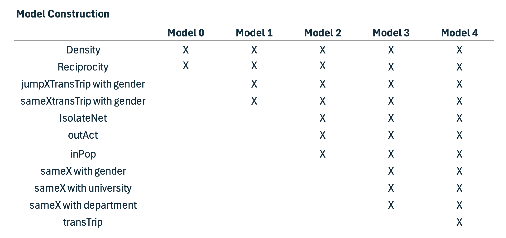

```{r, echo=FALSE, include=TRUE, results='hide', message=FALSE, warning=FALSE}
library(knitr)
library(tidyverse)
library(scholar)
library(openalexR)
library(rvest)
library(jsonlite)
library(httr)
library(rvest)
library(reshape2)
library(xml2)
library(openxlsx)
library(polite)
library(igraph)
library(sna)
library(genderizeR)
library(RSelenium)
library(netstat)
library(pingr)
library(RSiena)
library(devtools)
library(RsienaTwoStep)


# load the functions you need from the packages
fpackage.check <- function(packages) {
  lapply(packages, FUN = function(x) {
    if (!require(x, character.only = TRUE)) {
      install.packages(x, dependencies = TRUE)
      library(x, character.only = TRUE)
    }
  })
}

fsave <- function(x, file = NULL, location = "./data/processed/") {
  ifelse(!dir.exists("data"), dir.create("data"), FALSE)
  ifelse(!dir.exists("data/processed"), dir.create("data/processed"), FALSE)
  
  if (is.null(file)) {
    file <- deparse(substitute(x))
  }
  
  datename <- substr(gsub("[:-]", "", Sys.time()), 1, 8)
  totalname <- paste(location, datename, file, ".rda", sep = "")
  save(x, file = totalname)  # need to fix if file is reloaded as input name, not as x.
}

fload <- function(filename) {
  load(filename)
  get(ls()[ls() != "filename"])
}

fshowdf <- function(x, ...) {
  knitr::kable(x, digits = 2, "html", ...) %>%
    kableExtra::kable_styling(bootstrap_options = c("striped", "hover")) %>%
    kableExtra::scroll_box(width = "100%", height = "300px")
}
```

```{r klippy, echo=FALSE, include=TRUE}
klippy::klippy(position = c('top', 'right'))
#klippy::klippy(color = 'darkred')
#klippy::klippy(tooltip_message = 'Click to copy', tooltip_success = 'Done')
```

Last compiled on `r format(Sys.time(), '%B, %Y')`
<br>
------------------------------------------------------------------------

# Exploratory Analyses

For the exploratory analyses, I examine whether A -> B -> C are likely to be closed or maintained by A, depending on the gender composition of the triad. Specifically, I investigate whether A is more likely to create or maintain a tie to C when C is of a different gender than A and B (H1), or whether the opposite happens and A is more likely to break or avoid a tie with C, when C is of a different gender than A and B (H2). Additionally, I will analyse whether A is likely to create or maintain a tie to C when C is of the same gender as A and B (H3).

In RSiena, network dynamics are modeled as actors making decisions at each time step to either create new ties, maintain existing ties, break existing ties, or choose not to form ties. Thus, when referring to A creating or maintaining a tie to C, this is contrasted with A breaking or avoiding a tie with C. In other words, the hypotheses test whether ties are more likely to be present (through creation or maintenance) rather than absent (through dissolution or non-creation) based on the gender composition of the triad.


As previously described in the Data and Methods section, the model construction followed an iterative process informed by both the Goodness Of Fit (GOF) of the models and theoretical considerations.


<br>

## Prepare for analysis
```{r}
load("./data/processed/result_gender2.rda")

wave1 <- result_gender2$nets[1,,]
wave2 <- result_gender2$nets[2,,]

# a few people did work with themselves:
diag(wave1) <- 0
diag(wave2) <- 0


net_gender <- array(data = c(wave1, wave2), dim = c(dim(wave1), 2))
# net_gender

# dependent
net2 <- sienaDependent(net_gender)

# independent variables

# Gender
gender <- result_gender2$demographics$gender
gender <- ifelse(is.na(gender), NA, 
                 ifelse(gender == "female", 1, 0))
gender <- coCovar(gender)


# University
# because I will only use this as a control using sameX
# and sameX merely checks whether two nodes have the same value of X
# and does not look at the order in which the universities are
# I can just make it a factor

result_gender2$demographics$Universiteit1.24[result_gender2$demographics$Universiteit1.24 == ""] <- NA

university_vector <- 
as.numeric(as.factor(result_gender2$demographics$`Universiteit1.22`))

university <- coCovar(university_vector) 

# Discipline
# Because discipline is literally time constant between 2022 and 2024
# (it said 65 people switched, but those were just missings in 2022 which were identified in 2024)
# and 2024 is complete
# I will use the data from 2024.

discipline <- as.numeric(as.factor(result_gender2$demographics$`discipline.24`))
discipline <- ifelse(is.na(discipline), NA,
                     ifelse(discipline == "2", 1, 0))
discipline <- coCovar(discipline) 

# Create siena data object
mydata3 <- sienaDataCreate(net2, gender, university, discipline)
#mydata3

myeff <-getEffects(mydata3)

ifelse(!dir.exists("results"), dir.create("results"), FALSE)
print01Report(mydata3, modelname = "./results/result_gender")
```
<br>

## Model 0

### Run model
This model only contains the standard statistics of Rsiena: density and reciprocity. 
```{r, eval = FALSE}
myAlgorithm <- sienaAlgorithmCreate(projname = "result_gender")
ansM0 <- siena07(myAlgorithm, data = mydata3, effects = myeff, returnDeps = TRUE)

save(ansM0, file = "ansM0.RData")
```

```{r}
load("ansM0.RData")
ansM0
```

### Interpretation

This null model achieves a very low convergence ratio of 0.03. This is expected, as the model includes only two basic structural effects (density and reciprocity), which makes estimation straightforward and convergence easy to achieve.

The RSiena model results indicate that the network is relatively sparse, as shown by the significant negative outdegree effect (b = -4.12, SE = 0.07). This means that nodes generally form few ties overall. However, ties that do form are highly reciprocal, as the reciprocity effect is significant and positive (b = 3.67, SE = 0.16).

### GOF indegree

The null model achieves a goodness-of-fit (GOF) value of 0 for the indegree distribution. The GOF measure indicates how well the model reproduces the structure of the observed network—in this case, the distribution of incoming ties. The results show that the model fits the data poorly, underestimating the number of actors with zero incoming ties and overestimating those with one or two.

```{r, eval = F}
gofi0 <- sienaGOF(ansM0, IndegreeDistribution, verbose = FALSE, join = TRUE, varName = "net2", cumulative = F)

save(gofi0, file = "gofi0.RData")
```

```{r}
load("gofi0.RData")
plot(gofi0, violin = F)
```

### GOF outdegree

Similarly, the goodness-of-fit value for the outdegree distribution is 0, indicating that the model does not adequately capture the structure of the observed outdegree distribution. The number of nodes which do not send any ties is underestimated and the number of nodes who send only one tie is severly overestimated. 

```{r, eval = F}
gofi01 <- sienaGOF(ansM0, OutdegreeDistribution, verbose = FALSE, join = TRUE, varName = "net2", cumulative = F)
save(gofi01, file = "gofi01.RData")
```

```{r}
load("gofi01.RData")
plot(gofi01, violin = F)
```

### Conclusion

The statistics suggest that nodes generally form few ties overall, but when they do, the ties are highly reciprocal. 

The GOF plots indicate that the model may need additional statistics to better capture the prevalence of nodes with no outgoing or incoming ties. However, first, I will look at the main statistics of interest: jumpXTransTrip (for Hypothesis 1 and 2) and homXTransTrip (for Hypothesis 3).

<br>

## Model 1

### Include effects 
```{r, eval = F}
myeff <- setEffect(myeff, jumpXTransTrip, interaction1 = "gender", include = T)
myeff <- setEffect(myeff, homXTransTrip, interaction1 = "gender", include = T)
```
### Run model
```{r, eval = FALSE}
myAlgorithm <- sienaAlgorithmCreate(projname = "result_gender")
ansM1 <- siena07(myAlgorithm, data = mydata3, effects = myeff, returnDeps = TRUE)

save(ansM1, file = "ansM1.RData")
```

```{r}
load("ansM1.RData")
ansM1
```

### Interpretation 

With an overall convergence ratio of 0.16, the model shows good convergence, suggesting that the parameter estimates are stable and the model is well estimated.

The outdegree and reciprocity effects remain similar to those in Model 0. Both the jumpXTransTrip and homXTransTrip effects are positive and statistically significant.

The jumpXTransTrip effect (3.50, SE = 0.38) indicates that in A -> B -> C triads, actor A is more likely to form or maintain a tie with C, rather than dissolve or refrain from forming one, when C is of a different gender than both A and B. This finding supports Hypothesis 1, consistent with Contact Theory, and contradicts Hypothesis 2, derived from Social Identity Theory (SIT). It suggests that A tends to collaborate with C despite C's gender difference to A and B. 

The homXTransTrip effect (1.61, SE = 0.24) indicates that actor A is also more likely to form or maintain a tie with C, rather than dissolve or refrain from forming one, when C shares the same gender as both A and B. This finding supports Hypothesis 3, in line with Social Identity Theory, suggesting that A is likely to collaborate with C when C is the same gender as A and B.

Taken together, these results imply that triadic closure occurs both across and within gender groups. Because both types of triads are favored, there is no clear restriction on tie formation based on gender: A is likely to collaborate with C regardless of whether C shares A’s and B’s gender.

Although these effects are statistically significant, this does not guarantee that the model reproduces the observed network structure, particularly the triadic patterns central to this study. To assess this, a triad census goodness-of-fit test is condcuted to evaluate how well Model 1 captures these triadic structures, complementing the indegree and outdegree goodness-of-fit tests.

### GOF indegree

This model does not capture the indegree distribution of the observed network (p = 0), and shows the same misestimations as Model 0. 

```{r, eval = F}
gofi1 <- sienaGOF(ansM1, IndegreeDistribution, verbose = FALSE, join = TRUE, varName = "net2", cumulative = F)

save(gofi1, file = "gofi1.RData")
```

```{r}
load("gofi1.RData")
plot(gofi1, violin = F)
```

### GOF outdegree

Similarly, the outdegree distribution is not well represented (p = 0), with the same patterns of under- and overestimation as Model 0.

```{r, eval = F}
gofi2 <- sienaGOF(ansM1, OutdegreeDistribution, verbose = FALSE, join = TRUE, varName = "net2", cumulative = F)
save(gofi2, file = "gofi2.RData")
```

```{r}
load("gofi2.RData")
plot(gofi2, violin = F)
```

### GOF triad census

The graph below shows that the model does not adequately reproduce the local triadic structures of the observed network (p = 0).

The first three triad types (003, 012, 102) are well captured by the model. These configurations represent disconnected or minimally connected triads, and the good fit likely reflects the inclusion of outdegree and reciprocity effects.

However, the model underestimates both 021D (two nodes receiving ties from the same node) and 021U (two nodes sending ties to the same node), suggesting that it does not fully capture patterns of high activity or popularity. Including explicit effects for outdegree activity and indegree popularity could improve the fit for these structures.

In contrast, the 021C configuration (A -> B, B -> C) is well reproduced, indicating that the jumpXTransTrip and homXTransTrip terms successfully capture simple sequential patterns.

The model struggles with several more complex triads. The 111D triad, which combines a mutual tie with an additional asymmetric tie, is clearly misfit, suggesting that while reciprocity is captured at the dyadic level, the model fails to extend this pattern to triads where mutual and asymmetric ties coexist. Similarly, the 030T (transitive) and 030C (cyclic) triads are poorly reproduced, indicating that the current transitivity terms do not fully capture the observed extent of hierarchical and cyclic closure.

Mixed reciprocity–transitivity configurations such as 120D and 120C are also underestimated, confirming that the model does not adequately capture overlapping patterns of mutual and asymmetric ties.

In conclusion, these results suggest that the current model captures basic triadic structures but fails to reproduce more complex patterns of activity, popularity, and closure. 

```{r, eval = F}
gofi3 <- sienaGOF(ansM1, TriadCensus, verbose = FALSE, join = TRUE, varName = "net2")
save(gofi3, file = "gofi3.RData")
```

```{r}
load("gofi3.RData")
plot(gofi3, violin = F, center = T, scale = T)
```

### Conclusion

Although the model shows significant jumpXTransTrip and homXTransTrip effects, it fails to adequately capture several key structures in the observed network, indicating the need for refinement.

I will start with this refinement at the ego level. 

The GOF plots for the indegree and outdegree distributions reveal many nodes with no incoming or outgoing ties. My descriptive analyses confirmed a substantial number of isolates in the data. To address this, the next model will include the ego-level statistic isolateNet, which accounts for nodes with no ties.

Additionally, ego-level effects such as indegree popularity and outdegree activity are important for reproducing the overall distribution of ties in the network, which in turn can improve the model’s representation of higher-order structures like triads.

<br>

## Model 2

### Include effects 
```{r, eval = F}
myeff <- setEffect(myeff, isolateNet, include = T)
myeff <- setEffect(myeff, outAct, include = T)
myeff <- setEffect(myeff, inPop, include = T)
```
### Run model
```{r, eval = FALSE}

myAlgorithm <- sienaAlgorithmCreate(projname = "result_gender")
ansM2 <- siena07(myAlgorithm, data = mydata3, effects = myeff, returnDeps = TRUE, prevAns = ansM1 )

save(ansM2, file = "ansM2.RData")
```

```{r}
load("ansM2.RData")
ansM2
```

### Interpretation 

The overall convergence ratio is 0.58, which is higher than in Model 1, indicating that some parameter estimates are unstable and the model may not be reliably estimated.

Compared to Model 1, the outdegree (density) and reciprocity parameters remain stable.

In this model, more ego-level effects were added to account for individual differences in tie-sending and tie-receiving behavior.The indegree popularity effect (0.18, SE = 0.03) is positive and statistically significant, showing that actors who already receive many incoming ties are more likely to receive additional ones. This reflects a “popularity” process in which well-connected actors continue to attract collaborations.

The outdegree activity effect is small and negative (−0.08, SE = 0.03), suggesting that actors who already send many ties are slightly less likely to initiate further ones.

The network-isolate effect (5.76, SE = 0.87) is large and significant, indicating that isolates—actors without any incoming or outgoing ties—are overrepresented in the observed network.

Turning to the gender-related triadic effects, both homXTransTrip (1.08, SE = 0.21) and jumpXTransTrip (2.36, SE = 0.31) remain positive and statistically significant, although their magnitudes are smaller than in Model 1. This suggests that part of the variation previously captured by these terms was due to unmodeled individual-level differences, now accounted for by ego-level effects.

The continued significance of these positive effects provides support for Hypothesis 1 and refutes Hypothesis 2: in a triad A -> B -> C, where A and B share the same gender and C is different, A is likely to initiate or maintain collaboration with C. The results furthermore continue to support Hypothesis 3, which posits that A is likely to initiate or maintain collaboration with C when C shares the same gender as A and B. Taken together, these findings still indicate that gender itself does not strongly constrain collaboration: node A is likely to form or maintain ties with C regardless of whether C shares the gender of A and B.

### GOF indegree

When visually inspecting the GOF plot, Model 2 appears to capture the indegree distribution structure of the observed network somewhat better than Model 1. However, the overall fit remains poor (p = 0), indicating that the model still fails to adequately reproduce the observed indegree distribution.

```{r, eval = F}
gofi4 <- sienaGOF(ansM2, IndegreeDistribution, verbose = FALSE, join = TRUE, varName = "net2", cumulative = F)

save(gofi4, file = "gofi4.RData")
```

```{r}
load("gofi4.RData")
plot(gofi4, violin = F)
```

### GOF outdegree

In contrast, Model 2 adequately reproduces the observed outdegree distribution (p = 0.43). The plot shows that the number of nodes with each outdegree falls within the model’s upper and lower bounds.

```{r, eval = F}
gofi5 <- sienaGOF(ansM2, OutdegreeDistribution, verbose = FALSE, join = TRUE, varName = "net2", cumulative = F)
save(gofi5, file = "gofi5.RData")
```

```{r}
load("gofi5.RData")
plot(gofi5, violin = F)
```

### GOF triad census

Visually, Model 2 appears to capture the triadic structures in the observed network better than Model 1, with more configurations falling within the model’s upper and lower bounds. However, the overall fit remains poor (p = 0).

Several triad types are now better represented. The triad configurations 021D (two nodes receiving ties from the same node) and 021U (two nodes sending ties to the same node) are now well captured, likely due to the inclusion of indegree popularity and outdegree activity statistics. Triads 111D, 030T, and 120D also show improved fit compared to Model 1.

The 021C triad is captured less well than in Model 1. Including ego-level effects such as indegree popularity, outdegree activity, and isolate status increases the baseline probability of tie formation for certain actors. This tends to improve the fit for degree-related structures but can also lead the model to overestimate sequential ties, resulting in more 021C triads than are observed. A similar overestimation occurs for 111U, while the 120C triad remains poorly captured.

```{r, eval = F}
gofi6 <- sienaGOF(ansM2, TriadCensus, verbose = FALSE, join = TRUE, varName = "net2")
save(gofi6, file = "gofi6.RData")
```

```{r}
load("gofi6.RData")
plot(gofi6, violin = F, center = T, scale = T)
```

### Conclusion

Including ego-level statistics does not substantially alter the effect sizes of jumpXTransTrip and homXTransTrip. This indicates that the conclusion from Model 1 still holds: actor A is likely to form or maintain a tie with C (rather than dissolve or refrain from forming one) both when C shares the same gender as A and B and when C has a different gender. Overall, gender does not appear to constrain tie formation in these triadic structures.

The model captures the observed outdegree distribution very well. While there are some improvements in representing the indegree distribution and triadic structures, these fits remain poor.

For the next model, I include dyadic effects by adding the sameX statistic for gender, university, and department. This allows me to control for baseline homophily (A’s general preference to collaborate with C due to similarity in gender) so that I can more accurately test whether group structures, as predicted by contact theory or social identity theory, actually influence A's choice. University and department are included as additional controls for structural tendencies to collaborate within the same institution or discipline.

<br>

## Model 3

### Include effects 
```{r, eval = F}
myeff <- setEffect(myeff, sameX, interaction1 = "gender", include = T)
myeff <- setEffect(myeff, sameX, interaction1 = "university", include = T)
myeff <- setEffect(myeff, sameX, interaction1 = "discipline", include = T)
```
### Run model
```{r, eval = FALSE}

myAlgorithm <- sienaAlgorithmCreate(projname = "result_gender")
ansM3 <- siena07(myAlgorithm, data = mydata3, effects = myeff, returnDeps = TRUE, prevAns = ansM2 )

save(ansM3, file = "ansM3.RData")
```

```{r}
load("ansM3.RData")
ansM3
```

### Interpretation 

The overall maximum convergence ratio of this model was 0.16, which is considered good and much lower than in the previous model.

While the effects of outdegree and reciprocity are largely similar to those in the previous model, indegree popularity and outdegree activity are no longer significant. These structures appear to have been accounted for by dyadic-level homophily. The effect of isolates remains strong.

Interestingly, the homXTransTrip effect is no longer significant, likely because the sameX gender effect accounts for why A chooses to send a tie to C. This pattern does not reflect a shared social identity between A and B prompting collaboration with C, but rather A’s individual preference to work with researchers of the same gender. This finding contradicts Hypothesis 3, which, based on social identity theory, predicted that if A and B share a gender, A would be more likely to close or maintain the triad when C is of the same gender. Overall, this suggests that the specific gender configuration within the triad is not a decisive factor in collaboration, but rather A's individual preference. 

The jumpXTransTrip effect is weaker than in the previous model, indicating that the dyadic sameX effects account for part of this tendency. However, the effect remains significant and positive, consistent with hypothesis 1, and contrary to hypothesis 2: in the triad A -> B -> C, A is likely to initiate or maintain (rather than break of abstain from) a collaboration with C when C differs in gender from both A and B.

Regarding dyadic homophily, nodes show a tendency to form or maintain ties with others who share the same gender (b = 1.18, SE = 0.10), university affiliation (b = 1.92, SE = 0.14), and discipline (b = 2.31, SE = 0.29). All of these effects are positive and statistically significant.

### GOF indegree

Model 3 still fails to accurately capture the indegree distribution in the observed network (p = 0). It still underestimates the number of nodes with no incoming ties and overestimates nodes with one or two incoming ties.

```{r, eval = F}
gofi7 <- sienaGOF(ansM3, IndegreeDistribution, verbose = FALSE, join = TRUE, varName = "net2", cumulative = F)

save(gofi7, file = "gofi7.RData")
```

```{r}
load("gofi7.RData")
plot(gofi7, violin = F)
```

### GOF outdegree

Model 3 continues to capture the outdegree distribution of the observed network well (p = 0.21). 

```{r, eval = F}
gofi8 <- sienaGOF(ansM3, OutdegreeDistribution, verbose = FALSE, join = TRUE, varName = "net2", cumulative = F)
save(gofi8, file = "gofi8.RData")
```

```{r}
load("gofi8.RData")
plot(gofi8, violin = F)
```

### GOF triad census

The following plot shows an improvement over the previous model in its ability to capture the triadic structures in the observed network. However, the model’s fit remains inadequate, as indicated by the low p-value (p = 0.002). For almost all triads, the observed counts fall within the model’s expected range, but the model still misrepresents three triad types: it overestimates the occurrences of 021C and 111U, while it underestimates 030T.

```{r, eval = F}
gofi9 <- sienaGOF(ansM3, TriadCensus, verbose = FALSE, join = TRUE, varName = "net2")
save(gofi9, file = "gofi9.RData")
```

```{r}
load("gofi9.RData")
plot(gofi9, violin = F, center = T, scale = T)
```

### Conclusion

Most importantly, Model 3 revealed that the homXTransTrip effect with gender can be explained by dyadic gender homophily, and not because of the specific gender composition of the triad. This contradicts hypothesis three, which based on social identity theory, predicted A would be likely to create or maintain ties with C when C was of the same gender as A and B. 

The jumpXTransTrip effect remained positive, which is still in line with hypothesis 1 and contradictory to hypothesis 2. 

This model demonstrates a mixed fit to the observed network. While it continues to capture the outdegree distribution reasonably well (p = 0.21), it fails to reproduce the indegree distribution accurately (p = 0), underestimating nodes with no incoming ties and overestimating those with one or two. The model also shows improvement in capturing triadic structures, though its overall fit remains inadequate (p = 0.002), particularly for certain triad types. 

To address these remaining discrepancies in structural closure, the next model introduces the transTrip effect, allowing for a more direct test of transitivity in tie formation.

<br>

## Model 4

### Include effects 
```{r, eval = F}
myeff <- setEffect(myeff, transTrip, include = T)
```
### Run model
```{r, eval = FALSE}

myAlgorithm <- sienaAlgorithmCreate(projname = "result_gender")
ansM4 <- siena07(myAlgorithm, data = mydata3, effects = myeff, returnDeps = TRUE, prevAns = ansM3 )

save(ansM4, file = "ansM4.RData")
```

```{r}
load("ansM4.RData")
ansM4
```

### Interpretation 
The overall maximum convergence ratio of this model was satisfactory (0.15), indicating good model convergence and stable parameter estimation.

Most effects remained consistent with those observed in Model 3. Both indegree popularity and outdegree activity are again significant.

Regarding the gendered triadic hypotheses, the jumpXTransTrip effect is no longer significant after the inclusion of transTrip, which is positive and significant (b = 1.11, SE = 0.20). This indicates that in triads A -> B -> C, where C is of a different gender than A and B, gender does not influence A’s decision to create or maintain a tie with C. Rather, because transTrip is significant and positive, A is likely to create or maintain a transitive triad regardless of C’s gender. This finding runs counter to my hypotheses, suggesting that gender does not meaningfully influence tie formation in these mixed-gender triads. Instead, tie formation appears to be primarily driven by general triadic closure: “a friend of my friend is my friend.”

Interestingly, the homXTransTrip effect becomes slightly but significantly negative once the general transitive triplet effect is included. This suggests that same-gender triads are somewhat less likely to close than to remain open or dissolve once overall triadic closure tendencies are accounted for. Consequently, the third hypothesis — that actor A is more likely to form or maintain a tie with C when C shares A and B’s gender — is not supported either.

Overall, these results indicate that gender does not meaningfully constrain triadic closure in this network. Instead, tie formation appears to be primarily shaped by the general social tendency toward triadic closure.

### GOF indegree

The indegree distribution structure remains a bad fit (p = 0). <span style="color:grey"> I already tried several other additions (such as inPopSqrt, inIsDegree) but they did not improve the fit so I will leave this be :( </span>

```{r, eval = F}
gofi10 <- sienaGOF(ansM4, IndegreeDistribution, verbose = FALSE, join = TRUE, varName = "net2", cumulative = F)

save(gofi10, file = "gofi10.RData")
```

```{r}
load("gofi10.RData")
plot(gofi10, violin = F)
```

### GOF outdegree

The GOF of outdegree distribution is slightly lower than before (p = 0.17), but it still reveals a good fit. 

```{r, eval = F}
gofi11 <- sienaGOF(ansM4, OutdegreeDistribution, verbose = FALSE, join = TRUE, varName = "net2", cumulative = F)
save(gofi11, file = "gofi11.RData")
```

```{r}
load("gofi11.RData")
plot(gofi11, violin = F)
```
### GOF triad census

The GOF assessment of the triad census indicates that the model still does not fit the data well (p = 0.006). With the addition of TransTrip, the 021C triads are now well captured. However, the model continues to heavily underestimate 111U triads and overestimate 030T triads. 

<span style="color:grey"> Sidenote: I imagine that achieving a good GOF for the triad census is especially challenging, given the many different configurations that must all be captured accurately. </span>


```{r, eval = F}
gofi12 <- sienaGOF(ansM4, TriadCensus, verbose = FALSE, join = TRUE, varName = "net2")
save(gofi12, file = "gofi12.RData")
```

```{r}
load("gofi12.RData")
plot(gofi12, violin = F, center = T, scale = T)
```
### Conclusion

None of the gender-based hypotheses are supported by the model. The jumpXTransTrip effect shows that actor A is not more likely to form or maintain ties with C when C is of a different gender than A and B, contradicting hypothesis 1 and hypothesis 2. Similarly, the homXTransTrip effect becomes slightly negative after accounting for general triadic closure, indicating that same-gender triads are not more likely to close, and hypothesis 3 is not supported. Overall, it apperas gender does not meaningfully influence tie formation in these triads.

Caveat based on GOF: While the model captures outdegree patterns well, the fit for indegree distribution and triadic structures is poor. This suggests that, although the model provides a clear indication that gender is not a primary driver of collaboration, it may not fully capture all structural tendencies in the observed network.


