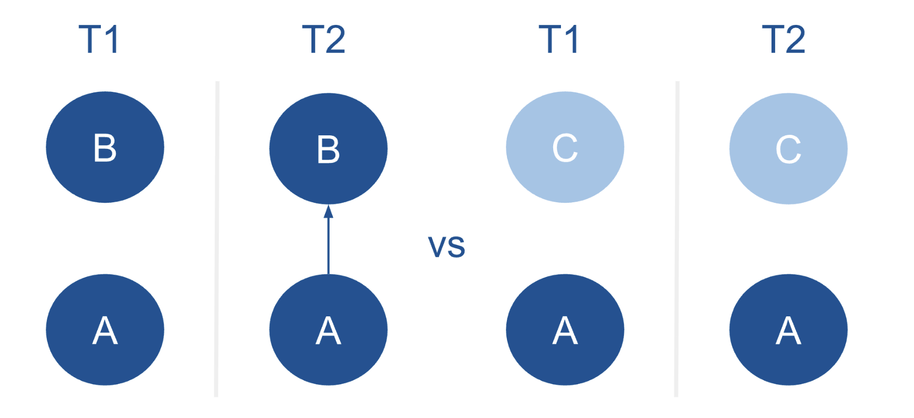
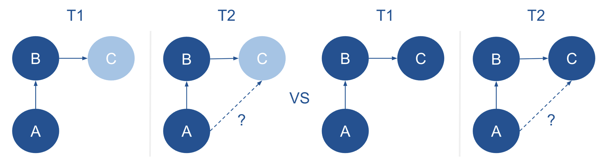

```{r, globalsettings, echo=FALSE, include=TRUE, warning=FALSE, results='hide'}
library(knitr)

knitr::opts_chunk$set(echo = TRUE)
opts_chunk$set(tidy.opts=list(width.cutoff=100),tidy=TRUE, warning = FALSE, message = FALSE,comment = "#>", cache=TRUE, class.source=c("test"), class.output=c("test2"))
options(width = 100)
#rgl::setupKnitr()


colorize <- function(x, color) {sprintf("<span style='color: %s;'>%s</span>", color, x) }

```

```{r klippy, echo=FALSE, include=TRUE}
klippy::klippy(position = c('top', 'right'))
#klippy::klippy(color = 'darkred')
#klippy::klippy(tooltip_message = 'Click to copy', tooltip_success = 'Done')
```

Last compiled on `r format(Sys.time(), '%B, %Y')`
<br>

------------------------------------------------------------------------

# Introduction

Gender segregation persists within academia, reinforcing structural inequalities by limiting men’s and women’s equal access to influential networks, mentorship opportunities, and high-status collaborations [@powell2018gender]. Understanding the causes of this macro level segregation is crucial to addressing and ultimately overcoming these disparities.

In order to understand amacro level phenomenon like segregation, Coleman argued we must examine the micro-level mechanisms through which individual actions and interactions generate large-scale outcomes [@Coleman]. In this research project, I apply Social Network Analysis (SNA) to academic collaboration networks, as it provides a powerful framework for linking micro-level interactions to macro-level structures [@SNASS]. This allows me to examine researchers at the individual level (nodes), whom they collaborate with (ties), and, at the macro level, the overall structure of the network. By studying how researchers form, maintain, or avoid ties, I  can trace the micro-level behaviors that aggregate into macro-level patterns, such as gender segregation [@SNASS]. In this way, SNA operationalizes Coleman’s insight by linking individual decisions and interactions to emergent structural outcomes in academic networks.

A key mechanism underlying gender segregation is gender homophily: the tendency for researchers to collaborate preferentially with colleagues of the same gender [@wang2023homophily]. In social network analysis, homophily shapes how ties form and evolve, often producing clusters of individuals who share similar characteristics [@SNASS], such as gender. Over time, these clusters reinforce social divisions by concentrating interactions within groups and limiting cross-group exchange, thereby perpetuating inequalities in access to resources and opportunities.

Research has found that, in academia, homophily structures co-authorship networks, fostering gendered clusters that restrict access to mentorship, collaborations, and visibility [@wang2023homophily]. Wang’s analysis of the JSTOR corpus shows that this pattern persists even after accounting for disciplinary and demographic factors, indicating a persistent same-gender preference in collaboration.

Dyadic homophily has thus been identified in academic collaboration networks. This dyadic homophily focuses on pairs of individuals. For example, if researcher A has the same gender as researcher B, but researcher C is a different gender, dyadic homophily would predict it to be more likely that A forms a tie with B than with C.



However, researchers may not only be part of a dyadic duo, but maintain multiple collaborations. As a result, decisions about whom to collaborate with are shaped not only by individual preferences but also by the broader network of existing ties. While dyadic homophily influences many collaboration choices, the structure and composition of a researcher’s egonet can create both opportunities and constraints for new collaborations [@SNASS].

It can thus be important to look beyond dyadic ties. This is why this research project extends the literature by examining gendered collaboration patterns in triadic structures. A triadic structure is a network configuration involving three nodes [@SNASS]; here, I focus on triads in which researcher A has collaborated with B, and B has collaborated with C. 

I specifically investigate whether the gender of C affects A’s likelihood of collaborating with them, particularly when A and B share the same gender. Drawing on Contact Theory [@Allport] and Social Identity Theory [@Tajfel_Turner], I examine how indirect connections through shared collaborators can either bridge gender boundaries to promote cross-gender ties or reinforce existing gender segregation in academic networks.



Thus, while researchers may exhibit a micro-level tendency to collaborate with others of the same gender, these individual preferences are embedded within a broader network structure that may amplify or constrain them. To examine how such dynamics unfold, I analyse the triadic structures using social network data on 674 researchers from sociology and politicology departments in Dutch universities. The dataset consists of two waves: Wave 1 (2015-2018) and Wave 2 (2019-2023). To assess how gender shapes tie formation and maintenance within these triadic configurations, I first examine the prevalence of different triadic structures in the data and then analyse the gender composition of the two most central to my research (021C and 030T). This leads to the following two descriptive research questions:

RQ1: How frequently do different types of triadic structures occur within the network of researchers from sociology and politicology departments in Dutch Universities?

RQ2: How is gender distributed across the triadic structures, specifically triads 021C and 030T, within the network of researchers from sociology and politicology departments in Dutch Universities?

Next, I use the R package RSiena [@Rsiena] to examine triadic collaboration patterns. Specifically, I investigate whether, in a triad of the form A -> B -> C, the gender of C affects A’s likelihood of forming a collaboration when A and B share the same gender. This leads to my explanatory research question:

RQ3: To what extent does the gender of a potential third collaborator (C) influence triad closure when the initial two collaborators (A and B) share the same gender?


<br>

# References

