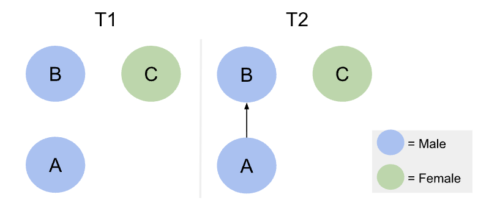

```{r, globalsettings, echo=FALSE, warning=FALSE, results='hide'}
library(knitr)

knitr::opts_chunk$set(echo = TRUE)
opts_chunk$set(tidy.opts=list(width.cutoff=100),tidy=TRUE, warning = FALSE, message = FALSE,comment = "#>", cache=TRUE, class.source=c("test"), class.output=c("test2"))
options(width = 100)
#rgl::setupKnitr()


colorize <- function(x, color) {sprintf("<span style='color: %s;'>%s</span>", color, x) }

```

```{r klippy, echo=FALSE, include=TRUE}
klippy::klippy(position = c('top', 'right'))
#klippy::klippy(color = 'darkred')
#klippy::klippy(tooltip_message = 'Click to copy', tooltip_success = 'Done')
```

Last compiled on `r format(Sys.time(), '%B, %Y')`
<br>

------------------------------------------------------------------------

# Introduction

<br>
------------------------------------------------------------------------
Gender segregation persists within academia [@powell2018gender], reinforcing structural inequalities by limiting men’s and women’s access to influential networks, mentorship opportunities, and high-status collaborations. Understanding the causes of this segregation is therefore crucial to addressing and ultimately overcoming these disparities.
A key mechanism contributing to gender segregation is gender homophily: the tendency for researchers to preferentially collaborate with colleagues of the same gender [@wang2023homophily]. Homophily is a fundamental principle in social network analysis, influencing the structure and evolution of networks by shaping the composition of ties between individuals. As Jochem Tolsma discusses in Social Network Analysis for Social Scientists [@SNASS], selective association can lead to the formation of tightly-knit clusters with shared characteristics, such as gender. Over time, these patterns reinforce existing social divisions, as individuals within a cluster are more likely to interact with one another than with those outside their group. This contributes to increased segregation, limiting cross-group interactions and perpetuating disparities in access to resources, opportunities, and information.

In academic contexts, homophily shapes co-authorship networks, fostering gendered clusters that restrict access to mentorship, resources, and high-impact collaborations, thereby sustaining inequalities across fields. Empirical evidence supports the presence of gender homophily in research collaborations [@wang2023homophily]. Analysis of the JSTOR corpus shows that this pattern cannot be fully explained by disciplinary or demographic factors; even after accounting for these, researchers still preferentially co-author with same-gender colleagues. 

This is all at the dyadic level, focusing on collaborations between pairs of individuals. For example, if academic A is a man, he is more likely to collaborate with academic B, also a man, than with academic C, a woman. These patterns reflect individual-level choices between two potential collaborators, without considering how these decisions interact within larger network structures.



While most prior research has focused on dyadic relationships—collaborations between pairs of researchers—this study extends the analysis to triadic structures, where three researchers are interconnected. Dyadic analyses capture individual-level preferences, such as a tendency for researchers to collaborate with colleagues of the same gender. However, they cannot fully capture higher-order network dynamics, where the structure of existing collaborations may influence the formation of new ties.

Triadic structures are particularly important in social network analysis because they often exhibit triadic closure: if researcher A collaborates with B, and B collaborates with C, there is an increased likelihood that A will collaborate with C as well. Triadic closure is not just a function of dyadic preference—it reflects how network structure mediates relationship formation, potentially amplifying gender homophily and reinforcing segregation within academic networks.

This study focuses on triads where two researchers, A and B, share the same gender, examining whether the gender of a potential third collaborator (C) affects the likelihood of the triad closing. By analyzing these patterns, we can uncover whether gendered clusters persist and expand beyond individual dyadic choices, highlighting a higher-order mechanism of inequality in academic collaborations.

To investigate these dynamics, the following research questions are posed:

RQ1. How prevalent are triadic collaborations in academic co-authorship networks?
This establishes the baseline: understanding whether triads are common enough to meaningfully influence network structure.

RQ2. Do these triads exhibit gender homophily?
This examines the composition of triads, testing whether same-gender clustering exists beyond dyadic preferences.

RQ3. Are triads with same-gender initial collaborators (A and B) more likely to close when the potential third collaborator (C) is of the same gender, compared to when C is of a different gender?
This tests whether gender homophily is amplified through triadic closure, revealing higher-order structural mechanisms that could reinforce gender segregation in academic collaborations.

By addressing these questions, this research extends the analysis of gender homophily from dyadic interactions to network-level processes, providing a more comprehensive understanding of how gendered collaboration patterns emerge and persist.


<br>
------------------------------------------------------------------------

# References

