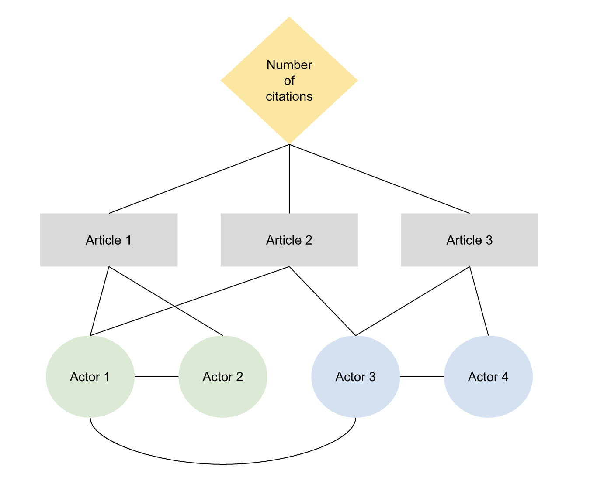

```{r, globalsettings, echo=FALSE, warning=FALSE, results='hide'}
library(knitr)

knitr::opts_chunk$set(echo = TRUE)
opts_chunk$set(tidy.opts=list(width.cutoff=100),tidy=TRUE, warning = FALSE, message = FALSE,comment = "#>", cache=TRUE, class.source=c("test"), class.output=c("test2"))
options(width = 100)
#rgl::setupKnitr()


colorize <- function(x, color) {sprintf("<span style='color: %s;'>%s</span>", color, x) }

```

```{r klippy, echo=FALSE, include=TRUE}
klippy::klippy(position = c('top', 'right'))
#klippy::klippy(color = 'darkred')
#klippy::klippy(tooltip_message = 'Click to copy', tooltip_success = 'Done')
```
```{r}
library(igraph)
```


Last compiled on `r format(Sys.time(), '%B, %Y')`
<br>

------------------------------------------------------------------------

# Week 2
<br>

------------------------------------------------------------------------

## Workshop
<br>

------------------------------------------------------------------------

### Presenting my RQ's
Today I presented my various research questions and we discussed how to make them more concrete. I drew the network, and after a lot of discussion, I now understand how I could visualize the network I wanted to analyse. 

<br>

------------------------------------------------------------------------

### Social networks in matrices
Next, with some help, I created a matrix filled with randomly assigned 0 and 1. Start coding in small steps: see what needs to happen, and create steps to get there. 


```{r}

# you can create 
# val2 <- sample(x = 0:1, size = 100*100, replace = TRUE, prob = c(0.8, 0.2))
# if you increase the probability of 1's then you have a higher density network

val <- sample(x = 0:1, size = 100*100, replace = TRUE)

mat = matrix(data = val, nrow = 100, ncol=100)
mat

# you can count how many ties a person has:
rowsums <- rowSums(mat)
rowsums

# you can see the percentage of 1's
rowmeans <- rowMeans(mat)
rowmeans
```


```{r}

# can say the diagonal needs to be a NA because people can't have ties with themselves it depends on the package you use whether you have to say NA or 0
diag(mat) <- NA
mat
```


```{r}
# you can also do it with for loops (more work)
# rep is replicate, is makkelijker dan typen
mat2 <- matrix(0, nrow = 100, ncol = 100)

for (col in 1:100) {
  for (row in 1:100) {
    mat2[row, col] <- sample(0:1, 1, replace = TRUE)
  }
}

mat2
```

```{r}
# if you want to have a symmetric matrix (undirexted network)
# need to be able to flip the rows and columns
val <- sample(x = 0:1, size = 100*100, replace = TRUE)

mat3 = matrix(data = val, nrow = 100, ncol=100)

# force symmetry
mat_sym <- (mat3 + t(mat3)) %% 2
mat_sym
#uses function upper triangle of the matrix

# you could also sum the networks: so if 1 knows 2 and 2 knows 1 they get a '2' 
# and then say all the 2's become 1's and all the 1's and 0's become 0's.
```
<br>

------------------------------------------------------------------------

### Chapter 2

Read Chapter 2 again: look at directional ties. Look at reciprocity.
How do you measure it?

reciprocity of network: number of reciprocal relations divided by the number of possible reciprocal ties
a possible reciprocal relationship is when at least one of the two people has a relationship with the other
because then it is possible for it to become reciprocal.

```{r}

val <- sample(x = 0:1, size = 4*4, replace = TRUE)

mat1 <- matrix(data = val, nrow = 4, ncol=4)
diag(mat1) <- 0
mat1

# transpose: make another matrix in which the columns and rows are switched
mat2 <- t(mat1)

# then add the networks so if there are two 1's so they become 2
mat3 <- mat1 + mat2
mat3

sum(mat3[upper.tri(mat3)] == 2)

# then divide by the number of possible reciprocal ties
# in this case there are 4 potential numbers 1/4 = 0.25

```

<br>

------------------------------------------------------------------------

You can describe networks by describing notes, the dyads, the egonets embedded in the network. And describing the network as a whole.

Multiplexity: the number of multiplex relationships/ possible number of multiplex relationships

Need to put the things that are in Chapter 2 in you theory section: show that you are familiar. 


Reformulate the questions for next week and keep it simple.Try to understand networks.
<br>

------------------------------------------------------------------------

### Chapter 4
Find the number of complete triads (= difficult).
The number of triads divided by the number of triads that could be closed.

```{r}
set.seed(123643)

net1 <- matrix(sample(0:1, 16, replace = TRUE), nrow=4, ncol=4)
net_un <- net1 + t(net1)
net_un[net_un ==2] <- 1
diag(net_un) <- 0
net_un

# six closed ones: you count the closed ones three times, because there are three ways they could be 'unclosed'
# the unclosed ones: 2
# 6/2 = 3

netg <- graph_from_adjacency_matrix(net_un)
netg
plot<- plot(netg)

igraph::transitivity(netg, type = "undirected")

```

For an egonet:
You can count the number of triads in an egonetwerk:
if there are none: the clustering = 0
if there is one out of three alters: the clustering = 1/3
High clustering (max = 1), can lead to higher stability of a network

```{r}
# DYAD CENSUS!!!
# find out how many dyads census are in our matrix
# we need a directed network
diag(net1) <-0
library(igraph)
neth <- graph_from_adjacency_matrix(net1)
dyad_census(neth)

plot1<- plot(neth)
# mut	  = the number of pairs with mutual connections = 3
# asym  = The number of pairs with non-mutual connections = 2
# null   = the number of pairs with no connection between them = 1

```

```{r}
# TRIAD CENSUS
# you get numbers for every kind of triangle (there are 16 kinds)
# ?triad_census
triad_census(neth)

```


```{r}
# RECIPROCITY = reciprocated relations/ all possible reciprocated relations

net1transp <- net1 + t(net1)

numtwos <- sum(net1transp == 2)
numonetwos <- sum(net1transp == 1 | net1transp == 2)

reciprocity <- numtwos/numonetwos

reciprocity
```


<br>

------------------------------------------------------------------------

### Betweenness

How important certain actors are to get information across. You want to get information from actor A to actor B, and there are three shortest connections. For two of those connections C is necessary, you divided the amount of paths that go through C, by the total shortest paths: 2/3. It's always only about the shortest paths. If there is a direct connection between A to B, then C is not important at all.
You have to do it for all dyads in the network.

It is about 0/1 networks, not about weighted networks. 

<br>

------------------------------------------------------------------------

## Homework

Workshop/Homework:

1. Update your research questions

2. Start writing your introduction in which you discuss your RQs, the relevance of a social network perspective

3. Find one or two relevant papers with respect to your research question and focus on the type of data they use.

4. Make a list of the type of data you will need (actor attributes, relational attributes, etc.) in order to answer your RQs from a social network perspective.

5. Update your lab journal / website

Also read chapter 2, 4, 6 (a little bit) and 8 !
Play around in OpenAlex

<br>

------------------------------------------------------------------------

### Wednesday 17 september

As I was unsure how to tackle the characterisation of the themes of articles, I decided to focus my research scope to the number of citations of articles. 

A framing for the introduction:
In academic research, researchers collaborate with each other, which not only combines expertise but also amplifies the reach and impact of scholarly work. This collaboration does not appear to be random: it is often shaped by homophily; the tendency to associate with others who are similar to oneself. In STEM fields, this tendency intersects with gender dynamics (Collins & Steffen-Fluhr, 2019). Men, who are often attributed higher status within academia, are more likely to co-author with other men. Women, on the other hand, defy the concept of homophily and are also more likely to co-author with men. This could be because men are attributed a higher status which makes it, in terms of impact, enticing to work together with men, or simply because there are simply more men within STEM. This raises a broader question: are such patterns unique to male-dominated disciplines, or do they persist even in fields where women are well-represented or hold the majority? The social sciences offer a compelling context to investigate these dynamics. Data allows us to research this within Dutch sociology and politicology departments. 

RQ1: To what extent does gender homophily shape collaboration patterns among researchers in Dutch sociology and politicology departments?
<br>
The gender composition of research collaborations is an important factor shaping whose work gains recognition in academia. Recent studies show that collaboration patterns are not neutral but can significantly influence the visibility and impact of scholarly articles. Chatterjee and Werner (2021), for instance, analyzed 5,554 articles in leading medical journals and found that papers with women in either the first or senior author position received fewer citations than those with men in the same roles. The effect was even more pronounced when both positions were held by women, whose articles received roughly half as many citations as male-authored counterparts. These findings indicate that looking only at individual authors or single publications obscures the broader dynamics at play. Instead, examining the gender composition of entire author teams provides a more complete understanding of how impact is distributed across the academic landscape.

While this evidence comes from medicine, a STEM field with persistently low representation of women, similar dynamics have been observed in disciplines with higher female participation, such as the social sciences. Casad et al. (2022), for example, found that in US social sciences, papers with men as both first and last authors were over-cited, whereas those with at least one woman in a lead position were systematically under-cited. This suggests that gendered citation disparities are not confined to male-dominated disciplines but may be a broader feature of academic publishing. Building on this evidence, the second research question is:

RQ2: How do the gender composition of collaborations among researchers in Dutch sociology and politicology departments shape the impact of their scholarly work? 



<br>

Casad, B. J., Garasky, C. E., Jancetic, T. R., Brown, A. K., Franks, J. E., & Bach, C. R. (2022). U.S. Women Faculty in the Social Sciences Also Face Gender Inequalities. *Frontiers in Psychology, 13*. https://doi.org/10.3389/fpsyg.2022.792756

Collins, R., & Steffen-Fluhr, N. (2019). Hidden patterns. *Equality Diversity And Inclusion An International Journal, 38*(2), 265–282. https://doi.org/10.1108/edi-09-2017-0183

Chatterjee, P., & Werner, R. M. (2021). Gender disparity in citations in High-Impact Journal articles. *JAMA Network Open, 4*(7), e2114509. https://doi.org/10.1001/jamanetworkopen.2021.14509

<br>

Disclaimer: Wu (2024) mentions how various research have shown minimum differences between an author's gender the number of citations an article receives, he only finds that women have a lower total number of citations due to their differing career trajectories. 

Wu, C. (2024). The gender citation gap: Approaches, explanations, and implications. *Sociology Compass, 18*(2). https://doi.org/10.1111/soc4.13189


<br>

------------------------------------------------------------------------

I furthermore read the chapters 4, 6 and 8 as I already read chapter 2. 

```{r}
# CHAPTER 6

# start with clean workspace
rm(list = ls())
library(data.table)  # mainly for faster data handling
library(tidyverse)  # I assume you already installed this one!
require(xml2)
require(rvest)
require(devtools)
# Note we're doing something different here. We're installing a *latest* version directly from
# GitHub This is because the released version of this packages contains some errors!

require(scholar)

# Get anchor data
soc_staff <- read_html("https://web.archive.org/web/20230528153336/https://www.ru.nl/sociology/research/staff/")
head(soc_staff)
class(soc_staff)

# so we need to find WHERE the table is located in the html 'inspect element' in mozilla firefox or
# 'view page source' and you see that everything AFTER /td in the 'body' of the page seems to be
# the table we do need
soc_staff <- soc_staff %>%
    rvest::html_nodes("body") %>%
    xml2::xml_find_all("//td") %>%
    rvest::html_text()

soc_staff
```


