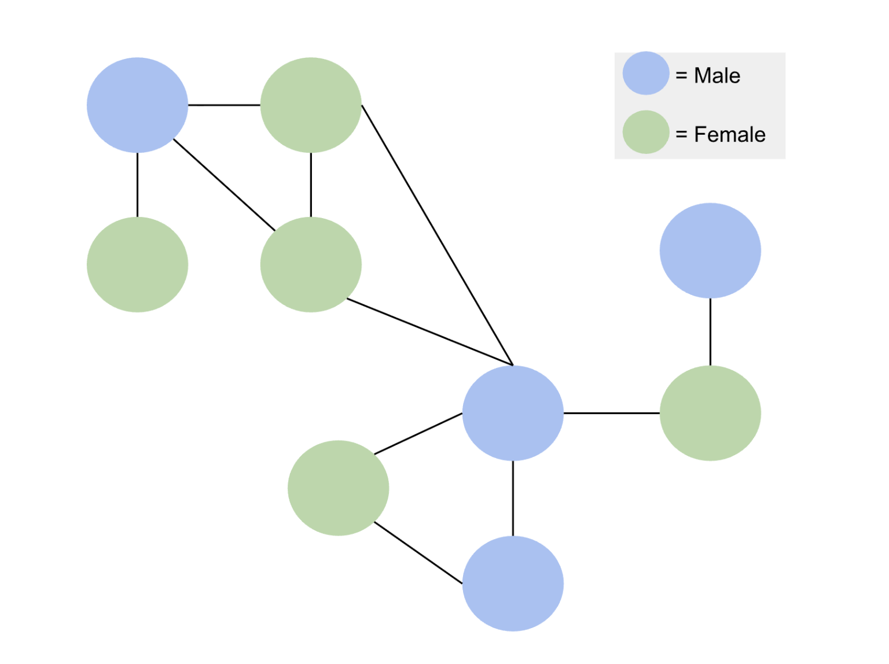

```{r, echo=TRUE, results='hide', message=FALSE, warning=FALSE}
library(knitr)
library(tidyverse)
library(scholar)
library(openalexR)
library(rvest)
library(jsonlite)
library(httr)
library(rvest)
library(reshape2)
library(xml2)
library(openxlsx)
library(polite)
library(RSelenium)

#load the functions you need from the packages
fpackage.check <- function(packages) {
  lapply(packages, FUN = function(x) {
    if (!require(x, character.only = TRUE)) {
      install.packages(x, dependencies = TRUE)
      library(x, character.only = TRUE)
    }
  })
}

fsave <- function(x, file = NULL, location = "./data/processed/") {
  ifelse(!dir.exists("data"), dir.create("data"), FALSE)
  ifelse(!dir.exists("data/processed"), dir.create("data/processed"), FALSE)
  if (is.null(file))
    file = deparse(substitute(x))
  datename <- substr(gsub("[:-]", "", Sys.time()), 1, 8)
  totalname <- paste(location, datename, file, ".rda", sep = "")
  save(x, file = totalname)  #need to fix if file is reloaded as input name, not as x. 
}

fload <- function(filename) {
  load(filename)
  get(ls()[ls() != "filename"])
}

fshowdf <- function(x, ...) {
  knitr::kable(x, digits = 2, "html", ...) %>%
    kableExtra::kable_styling(bootstrap_options = c("striped", "hover")) %>%
    kableExtra::scroll_box(width = "100%", height = "300px")
}

```

```{r klippy, echo=FALSE, include=TRUE}
klippy::klippy(position = c('top', 'right'))
#klippy::klippy(color = 'darkred')
#klippy::klippy(tooltip_message = 'Click to copy', tooltip_success = 'Done')
```

Last compiled on `r format(Sys.time(), '%B, %Y')`
<br>

------------------------------------------------------------------------

# Week 3
<br>

------------------------------------------------------------------------

## Workshop

In class we started with a recap: people are connected through social networks and therefore the observations can't be seen as independent. The theoretical part is now completed. 

Now: what are the implications for the data

You can't ONLY study individuals, but also the relations: so now you, need data on relations. This means you always have to get information from atleast 2 people. 

<br>

------------------------------------------------------------------------

### Survey data
How to get ego's from a survey:
1. Diary approach question: who have you talked to/met in the last week/month/etc?
2. Who are people you feel comfortable discuss difficult issues with? List a maximum of 5.
3. Who are the people at work you hang around with? 

Then, if someone mentioned 50 people, you can't ask them their relationship with everyone. So you sample people from each group/question, and ask them if they trust this person.

Then you ask the ego for contact information of the other people, or even better: send a link to the ego to send to the alters. To ensure this goes well: you get a bol.com voucher if the alter fills in the survey and then alter also got a gift card.

Ethics: Consent from alters. It's sensitive data. Especially web-scraping data.
Whether you get ethical permission or not: think for yourself, do you think it is appropriate?

<br>

------------------------------------------------------------------------

### Ethical webscraping
Ethical considerations: which sites can you webscrape, and why are you not allowed to scare certain websites?

The information is public, but by combining the data, we add extra information, we are doing stuff with the data, which it was not intended for. The purpose of the data changes. 

General Privacy Regulations law: you are allowed to do this, as long as it serves a higher societal goal and is not used for commercial purposes. 

If you do not abide to the terms of the website, the question is who has legal authority.

So we are collecting publicly available data, on a website which allows web scraping. We are then enriching that data with the gender of the persons (and ethnicity? weird).

<br>

### Practical webscraping

We are gong to use Xpath. Use xml code instead of HTML.
Div is just a section of a page, and the div has a class. Assigning a class to specific elements, tells a website what it should look like.
There are functions to get all information stored in a list.

```{r}

lpol_staff <- read_html("https://www.universiteitleiden.nl/en/social-behavioural-sciences/political-science/staff#tab-1")

# you can do this and then find the pattern with which the names start and say: only select those.
lpol_staff <- lpol_staff |>
  html_nodes("body") |>
  html_nodes(xpath = "//a") |> #collects all hyperlinks 
  html_text() #puts it into text

#lpol_staff

# a different way:
lpol_staff_names <- read_html("https://www.universiteitleiden.nl/en/social-behavioural-sciences/political-science/staff#tab-1") |>
    html_element("section.tab.active") |>
    html_elements("ul.table-list") |>
    html_elements("li") |>
    html_elements("a") |>
    html_elements("div") |>
    html_elements("strong") |>
    html_text()

lpol_staff_functions <- read_html("https://www.universiteitleiden.nl/en/social-behavioural-sciences/political-science/staff#tab-1") |>
    html_element("section.tab.active") |>
    html_elements("ul.table-list") |>
    html_elements("li") |>
    html_elements("a") |>
    html_elements("div") |>
    html_elements("span") |>
    html_text()

lpol_staff2 <- data.frame(name = lpol_staff_names, funct = lpol_staff_functions)
#lpol_staff2

```
<br>

For interactive websites: package Selenider. Can tell it to click on certain parts of pages. With open_url()

You could also use Rselenium
Can tell it to click on allow cookies when a popup shows up. Can also ask it to highlight the element, nice for constructing the web-scraper. 

<br>

### OpenAlexAI scraping

For our final project we need to collect data via OpenAlex.
You need to quiry your dataset before it is loaded in R, because it is too large to open in R.

Can retrieve information using api OpenAlex: https://api.openalex.org/works/W2741809807

Attributes, publications page 1:
You want read in JSON: fromJSON

```{r}

# load the dataset
df <- fload("./data/processed/20230620df_gender_jt.rda")

# link your email
options(openalexR.mailto = "mylene.husson@ru.nl") 

url <- "https://api.openalex.org/authors?search=Jochem Tolsma"

# based on what you have learned so far, you would probably first try:
jt <- read_html("https://api.openalex.org/authors?search=Jochem+Tolsma") %>%
    html_text2()

#substr(jt, 1, 100)

jt_json <- fromJSON("https://api.openalex.org/authors?search=Jochem+Tolsma", simplifyVector = FALSE)
#glimpse(jt_json, max.level = 1)

jt_json[["results"]][[1]][["display_name"]]
#jt_json$results[[1]]$display_name

#View(jt_json)

df <- oa_fetch(entity = "author", search = "Jochem Tolsma")
#fshowdf(df)

# can access parts of the list jt_json
#jt_json[["meta"]]
# could also put the number of the list there (is the third list in jt_json)
#jt_json[["3"]]

# you can also do it with $ and ask for the structure for instance
# str(jt_json$results)


# look at affiliations
#jt_json$results[[1]]$affiliations

```
<br>

OpenAlex have tutorials of how to get data: you need to read this.
You can also use Rappers which have functions which construct the correct URL to send to OpenAlex: in R the best one is "openalexR"
Then you don't have to understand the logic of AlexAPI, but then you have to study the R package. 

oa_query() is very important: can ask what you need, and then it constructs for you the correct URL which is sent to OpenAlexAI
but also need to retrieve it and convert it to a nice dataset
so use oa_fech()

<br>

------------------------------------------------------------------------

## Homework

Update your Research Questions
1. Construct your datasets (including your new variable/relation)

You only need to give prove of concept, and show how you would do that on a small scale. So collect co-authors, citations, citationscore data etc. Doing this with one variable is enough.

2. Describe your social network data (see week 2)

3. Be prepared to discuss the results of your descriptive statistics next week.

4. Start writing your data section and your result section

5. Update your lab journal / website

<br>

------------------------------------------------------------------------

### Friday 19 September

My refined research questions were not truly from a social network perspective so I will try again. This time I am not going to spend a lot of time finding research, seeking scientific and societal relevance, and writing a short introduction as that appears to have been a waste of time last time. I am going to stick with looking at the node level characteristic gender and zoom in on the position people have in their collaboration network: betweenness centrality. Betweenness centrality captures the extent to which a professor serves as a bridge connecting different co-authorship clusters, and this study investigates whether male or female professors in Dutch political science and sociology departments are more likely to occupy these strategically central positions in the network.

I can first look at how the collaboration patterns are clustered and then look at the positions men and women have. 

RQ1: “How are co-authorship collaborations among Dutch professors in political science and sociology structured? Are there identifiable clusters or communities of collaboration?”

Focus: overall network structure, clustering, density, community detection.

RQ2: “How does gender influence the likelihood of a professor occupying central positions (e.g., high betweenness centrality) in the co-authorship network?”

Focus: are women systematically less central than men?



------------------------------------------------------------------------

### Wednesday 24 September

Last week I already started on some code to figure out how to get information from OpenAlex. Today I continued with this. Here you can find what I figured out. 

```{r}
################################################################################

# Jochem name

# link your email
options(openalexR.mailto = "mylene.husson@ru.nl") 

url <- "https://api.openalex.org/authors?search=Jochem Tolsma"

# based on what you have learned so far, you would probably first try:
jt <- read_html("https://api.openalex.org/authors?search=Jochem+Tolsma") %>%
  html_text2()

#substr(jt, 1, 100)

jt_json <- fromJSON("https://api.openalex.org/authors?search=Jochem+Tolsma", simplifyVector = FALSE)
#glimpse(jt_json, max.level = 1)

List_names <- c()
List_names <- c(List_names, jt_json$results[[1]]$display_name)

################################################################################

List_citationindex <- c()
List_citationindex <- c(List_citationindex, jt_json$results[[1]]$cited_by_count)

#List_citationindex

################################################################################
# GET THE COLLABORATOR'S NAMES

#jt_json$results[[1]]$works_api_url
jt_publi <- fromJSON(jt_json$results[[1]]$works_api_url, simplifyVector = FALSE)

# Let's try to make a loop: get all of the people Jochem works together with

List_publi <- c()

for (j in 1:length(jt_publi$results)){
  for (i in 1:length(jt_publi$results[[j]]$authorships)) {
    List_publi <- c(List_publi, jt_publi$results[[j]]$authorships[[i]]$raw_author_name)
  }
}

List_publi

# But you don't just want to know the people, you want to know the collaborations
# So we will make a list of authors per paper, and add that list to a list of all people


List_colabs <- list()
for (j in 1:length(jt_publi$results)){
  List_authors <- c()
  for (i in 1:length(jt_publi$results[[j]]$authorships)) {
    List_authors <- c(List_authors, jt_publi$results[[j]]$authorships[[i]]$raw_author_name)
  }
  List_colabs[[j]] <- List_authors  # assign as list element
}

#View(List_colabs)

```
<br>

Now let's try with openalex api and excel data
```{r}


soc_pol <- readxl::read_excel("/Users/mylenehusson/Desktop/SocialNetworks/labjournal_mylene/data/20240419Scholarid_soc_pol.xlsx")

mail <- "mylene.husson@ru.nl"

author_list <- soc_pol$Naam[1:3]
#View(author_list)

all_author_data <- list()
all_colabs <- list()

for (author in author_list) {
  search <- tryCatch({
    oa_fetch(entity = "authors", 
             search = author, 
             mailto = mail)
  }, error = function(e) {
    message("Error with author: ", author)
    return(NULL)
  })
  
  if (is.null(search) || nrow(search) == 0) {
    next
  }
  
  # store the first result in the list
  all_author_data[[author]] <- search[1, ]
}

#View(all_author_data)

# From all_author_data we can now get the works_api_url
# and use the for loops we made before to get data on who they worked together with.

for (author in names(all_author_data)) {
  
  # get the works_api_url
  works_url <- all_author_data[[author]]$works_api_url
  
  # fetch the publications JSON from the API
  publi <- fromJSON(content(GET(works_url), as = "text"), simplifyVector = FALSE)
  
  List_colabs <- list()  # store co-authors per publication for this author
  
  # loop over each publication
  for (j in seq_along(publi$results)) {
    List_authors <- c()
    
    # loop over authorships in this publication
    for (i in seq_along(publi$results[[j]]$authorships)) {
      List_authors <- c(List_authors, 
                        publi$results[[j]]$authorships[[i]]$raw_author_name)
    }
    
    List_colabs[[j]] <- List_authors
  }
  
  # assign this author's collaborations to the main list
  all_colabs[[author]] <- List_colabs
}

#View(all_colabs)

# make it into a dataframe 
# Prepare a tidy data frame for all co-authors
df_colabs <- tibble()

for (author in names(all_colabs)) {
  # get the list of publications for this author
  pubs <- all_colabs[[author]]
  
  # flatten into a tidy format: one row per publication-author
  if (length(pubs) > 0) {
    df_tmp <- tibble(
      main_author = author,
      publication = rep(seq_along(pubs), times = sapply(pubs, length)),
      co_author = unlist(pubs)
    )
    df_colabs <- bind_rows(df_colabs, df_tmp)
  }
}

df_colabs
```
<br>

We could also get information on number of works counts

```{r}
work_count <- list()

for (author in names(all_author_data)) {
  work_count[[author]] <- all_author_data[[author]]$works_count
}


# Convert named list to data frame
df_work_count <- data.frame(
  author = names(work_count),
  works_count = unlist(work_count),
  row.names = NULL
)

head(df_work_count)
```

<br>

As for gender, I think I understand the code from Daphne from 2 years ago
But I can't get it to work, I think this might be because the site has changed.

```{r}

# only the first three rows of socpol
# Keep only the first 3 rows
soc_pol_small <- soc_pol[1:3, ]

soc_pol_small <- soc_pol_small |>
  mutate(firstname = word(Naam, 1))  # extract first names

# Initialize gender column
soc_pol_small$gender <- NA

# Set up polite session
#session <- bow("https://www.meertens.knaw.nl/nvb/naam/is", 
 #              user_agent = "mylene.husson@ru.nl")

# Loop over only these 3 rows
#for (i in seq_len(nrow(soc_pol_small))) {
  
  #name_url <- paste0("https://www.meertens.knaw.nl/nvb/naam/is/", soc_pol_small$firstname[i])
  
  #name_session <- nod(session, path = name_url)
  #name_page <- scrape(name_session)
  
  #table_list <- name_page %>% html_table()
  #table_list[[1]][table_list[[1]] == "--"] <- "0"
  
  #if (as.numeric(table_list[[1]]$X3[2]) > as.numeric(table_list[[1]]$X3[6])) {
  #  soc_pol_small$gender[i] <- "male"
  #} else {
  #  soc_pol_small$gender[i] <- "female"
  #}
  
  #print(paste(i, soc_pol_small$firstname[i], soc_pol_small$gender[i]))
#}

# View results for the 3 rows
#View(soc_pol_small)
```

<br>

Finally, I read the literature and scanned chapter 8.
For the graphs, perhaps use: 
install.packages("pak")
pak::pak('thomasp85/ggraph')