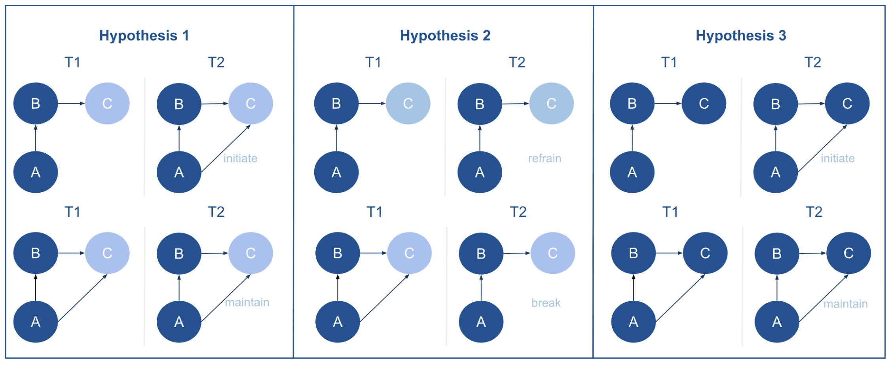

```{r, globalsettings, echo=FALSE, include=TRUE, warning=FALSE, results='hide'}
library(knitr)

knitr::opts_chunk$set(echo = TRUE)
opts_chunk$set(tidy.opts=list(width.cutoff=100),tidy=TRUE, warning = FALSE, message = FALSE,comment = "#>", cache=TRUE, class.source=c("test"), class.output=c("test2"))
options(width = 100)
#rgl::setupKnitr()


colorize <- function(x, color) {sprintf("<span style='color: %s;'>%s</span>", color, x) }

```

```{r klippy, echo=FALSE, include=TRUE}
klippy::klippy(position = c('top', 'right'))
#klippy::klippy(color = 'darkred')
#klippy::klippy(tooltip_message = 'Click to copy', tooltip_success = 'Done')
```


Last compiled on `r format(Sys.time(), '%B, %Y')`
<br>

------------------------------------------------------------------------

# Theory

The first two research questions are descriptive and not hypothesis-driven, but they are essential for establishing the local network landscape. Specifically, examining how frequently different triadic structures occur (RQ1) and how gender is distributed across these triads (RQ2) provides the foundation for understanding the context in which collaboration decisions take place.

The third research question, by contrast, is theory-driven and focuses on the micro-level mechanisms that may influence triadic closure. The social network structure central to this research is an A -> B -> C configuration, in which A and B share the same gender. I am interested in whether the gender of C affects A’s likelihood of forming or maintaining a tie with C. This can be interpreted through intergroup relations theories. The following section outlines how these theories, specifically Contact Theory and Social Identity Theory, apply to this triadic structure and inform competing hypotheses about gendered closure.

<br>

## Hypothesis 1

Contact Theory suggests that interactions between members of different social groups can reduce prejudice and foster more positive intergroup attitudes [@Allport]. Suppose researchers A and B are both men, and B has collaborated with researcher C, who is a woman. Even if A initially prefers to work with men, reflecting dyadic homophily [@wang2023homophily], observing that B has successfully collaborated with C may alter A’s perceptions. Through this indirect exposure, A experiences positive contact with an outgroup member via a trusted collaborator, which may increase his willingness to collaborate with C despite initial biases.

Previous social network research on extended contact shows that indirect exposure can indeed foster more positive intergroup attitudes [@Stark]. However, Stark notes that this effect requires the outgroup member to be more than a distant, unknown figure. In the context of sociology and political science departments in Dutch universities, I believe researchers are likely to be at least peripherally aware of one another. Therefore, I expect:

H1: In A -> B -> C collaboration triads within the sociology and political science departments of Dutch universities, where C differs in gender from A and B, A is more likely to initiate or maintain (rather than break or avoid) collaboration with C across the period from Wave 1 (2015–2018) to Wave 2 (2019–2023).

<br>

## Hypothesis 2

Social Identity Theory (SIT) posits that group membership forms a central part of an individual’s self-concept and can lead to ingroup favoritism and outgroup bias [@Tajfel_Turner]. Gender is a salient social identity, and people tend to automatically categorize others as male or female in interactions [@Carter]. Consequently, when researchers A and B share the same gender, their common identity can strengthen trust and ingroup cohesion, making A more inclined to collaborate with others of the same gender and more hesitant to collaborate with C if C belongs to a different gender. These triadic patterns can reinforce gender boundaries, promote same-gender clustering, and contribute to persistent gender segregation at the macro level.

Based on this reasoning, the opposite of Hypothesis 1 is expected: A is more likely to avoid collaboration with C when C differs in gender from both A and B, perceiving C as an outgroup member. Formally, this leads to the following hypothesis:

H2: In A → B → C collaboration triads within the sociology and political science departments of Dutch universities, when C differs in gender from A and B, A is more likely to break or refrain from forming a tie with C, rather than initiate or maintain collaboration, across the period from Wave 1 (2015–2018) to Wave 2 (2019–2023).

Conversely, when C shares the same gender as A and B, A is more likely to initiate or maintain collaboration, as C is considered part of the ingroup:

H3: In A → B → C collaboration triads within the sociology and political science departments of Dutch universities, where C is the same gender as A and B, A is more likely to initiate or maintain (rather than break or avoid) collaboration with C across the period from Wave 1 (2015–2018) to Wave 2 (2019–2023).

As these hypotheses are perhaps a bit hard to read, I created this visualization:



<br>

## Conclusion

Taken together, these intergroup theories offer contrasting predictions about how triadic structures relate to gender segregation in academic collaboration networks. Contact Theory predicts that indirect or mediated cross-gender collaborations can gradually reduce gender boundaries by promoting positive exposure across groups. Social Identity Theory, by contrast, predicts that individuals are more likely to form and maintain triads that reinforce gender similarity, as collaborating with same-gender peers strengthens trust and shared identity, thereby inhibiting the closure of mixed-gender triads. Testing both perspectives allows for an assessment of whether triadic closure processes in academic collaboration networks serve to bridge or reproduce gender divisions.

Social Network Analysis (SNA) provides an ideal framework for testing these competing hypotheses, as it allows for the systematic examination of how group-based identities shape network formation [@Wolf]. SNA enriches research on social identity, intergroup contact, and ingroup–outgroup dynamics by identifying substructures such as peer clusters or disciplinary communities, as well as by incorporating external attributes such as gender.


<br>

# References
